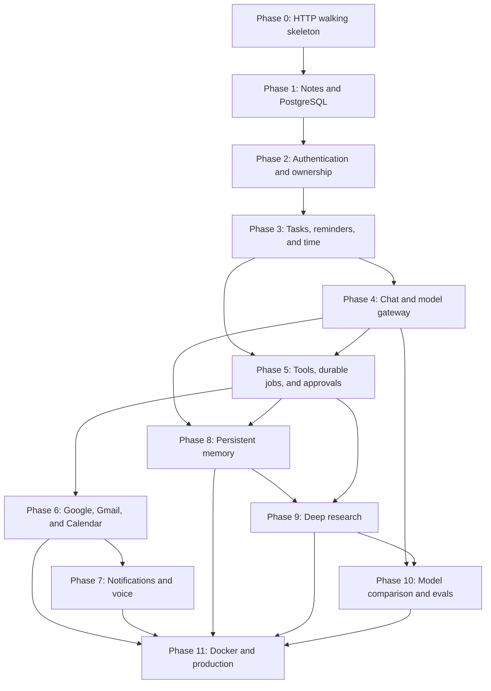

# Personal AI Workspace Backend: Complete Curriculum

This curriculum is the navigation layer for the complete backend build. It is intentionally split into phase handbooks: one giant document would make it harder to build, test, revisit, and understand one engineering concept at a time.

You are still expected to create the application yourself. The handbooks provide contracts, design decisions, carefully chosen reference snippets, test strategy, exercises, debugging work, and exit criteria. They do not replace the learning with a generated finished repository.

## 1. Architecture and dependency map

The system begins as one modular FastAPI application backed by PostgreSQL. Feature modules share explicit infrastructure and remain deployable as one unit. A worker is added only when durable work outlives an HTTP request.

The arrows are learning and implementation dependencies. For example, Gmail sending depends on the approval and durable-job boundary from Phase 5; it should not invent an unrelated execution system.

## 2. Complete reading and building order

| Phase | Complete handbook | Working exit artifact |
|---:|---|---|
| 0–1 | [Architecture, foundations, and Notes CRUD](BACKEND_LEARNING_AND_BUILD_GUIDE.md) | Locally running, migrated, PostgreSQL-backed Notes API with layered code and green tests |
| 2 | [Authentication and ownership](guides/PHASE_02_AUTHENTICATION_AND_OWNERSHIP.md) | Register/login/refresh/logout plus owner-isolated Notes |
| 3 | [Tasks, reminders, and time](guides/PHASE_03_TASKS_REMINDERS_AND_TIME.md) | User-scoped task/reminder workflows with explicit time and state rules |
| 4 | [Chat and model gateway](guides/PHASE_04_CHAT_AND_MODEL_GATEWAY.md) | Persistent chat through a fake and then a real provider adapter |
| 5 | [Tools, durable jobs, and approvals](guides/PHASE_05_TOOLS_JOBS_AND_APPROVALS.md) | Allowlisted, validated, approval-gated, auditable tool execution |
| 6 | [Google, Gmail, and Calendar](guides/PHASE_06_GOOGLE_GMAIL_AND_CALENDAR.md) | Secure Google connection, Calendar operations, Gmail read/draft/controlled send |
| 7 | [Notifications and voice](guides/PHASE_07_NOTIFICATIONS_AND_VOICE.md) | Verified channels, retryable delivery, safe inbound commands, voice proposals |
| 8 | [Persistent memory](guides/PHASE_08_PERSISTENT_MEMORY.md) | User-controlled memory with provenance, review, deletion, and evaluated retrieval |
| 9 | [Deep research](guides/PHASE_09_DEEP_RESEARCH.md) | Bounded resumable research jobs with source-to-claim citations |
| 10 | [Model comparison and evaluations](guides/PHASE_10_MODEL_COMPARISON_AND_EVALS.md) | Reconstructable multi-model runs and repeatable evaluation suites |
| 11 | [Docker and production](guides/PHASE_11_DOCKER_AND_PRODUCTION.md) | Containerized API/worker/migration topology with observability and tested recovery |

Every phase above has a complete handbook. Treat the links as the build order, and use each handbook's checkpoint—not the mere existence of its file—as your completion test.

Together they cover every requested backend capability: authentication and owner isolation; Notes, Tasks, and Reminders CRUD; chat; a tool registry and execution audit; Google Calendar and Gmail; Telegram, email, and Slack notifications; voice input; persistent memory; cited deep research; model comparisons/evals; and Docker/production operations. Provider-facing phases always reach a deterministic fake first, then enable a deliberately configured real adapter; this keeps the project runnable and the tests repeatable without silently spending money.

## 3. Rules that apply to every phase

Before implementing each endpoint, complete the endpoint worksheet from the foundation guide. Every endpoint must define:

1. Caller-centered purpose.
2. HTTP method and versioned path.
3. Authentication and resource-specific authorization.
4. Path and query parameters with types, defaults, and bounds.
5. Request fields, constraints, optionality, nullability, and unknown-field policy.
6. Success status, headers, and exact response shape.
7. Every expected failure with a stable error code and HTTP status.
8. Tables read and written.
9. Transaction boundary and external side effects.
10. Unit, PostgreSQL integration, contract, authorization, failure, and retry tests as applicable.

This is a build gate, not just a reading checklist. For every route, create a learner-owned worksheet such as `docs/endpoints/<method>-<resource>.md`, copy the handbook's completed contract into it, and restate each decision in your own words. Add any implementation-specific choice you made. Do not write the route decorator until every field above is filled and you have checked that the proposed tests can distinguish the success and failure contracts. If implementation reveals a missing decision, update the worksheet first and then the code. Commit the worksheet beside the vertical slice so the contract remains reviewable rather than living only in Swagger or memory.

Across the whole system, preserve these invariants:

- Routers own HTTP details, not SQL or business workflows.
- Services own use cases and transaction decisions.
- Repositories own SQLAlchemy persistence mechanics and never return HTTP errors.
- PostgreSQL constraints protect durable truth even if another writer bypasses FastAPI.
- Alembic migrations—not application startup—change schemas.
- Pydantic request and response models are distinct from ORM entities.
- Every query for user data is scoped by the authenticated owner in SQL.
- Provider SDKs remain behind small adapters; automated tests use fakes by default.
- Any side effect that may be retried has an identity, durable state, and an explicit idempotency policy.
- A model, webhook, transcript, or retrieved webpage can propose work but cannot grant authorization.
- Logs and API errors preserve evidence without exposing secrets or sensitive payloads.

The shared error vocabulary established by the foundation and authentication phases remains stable in every later handbook: request parsing/Pydantic failures are `422 REQUEST_VALIDATION_FAILED`; a cursor that passes primitive type/length validation but fails decode, version, signature, expiry, or filter binding is `400 INVALID_CURSOR`; a missing, malformed, expired, or otherwise invalid bearer credential is `401 INVALID_ACCESS_TOKEN` with `WWW-Authenticate: Bearer`; and an unclassified server bug is `500 INTERNAL_SERVER_ERROR`. Resource- and state-specific codes refine other expected failures. All use the same `{error:{code,message,details,request_id}}` envelope.

## 4. How to work through a handbook

For each vertical slice:

1. Read the concepts and official documentation named for that slice.
2. Complete the endpoint contract before writing the route.
3. Draw the request, transaction, state transition, and provider flow.
4. Write the narrow failing test.
5. Implement one path through schema → router → service → repository/adapter.
6. Run the narrow test, then the phase suite.
7. Inspect PostgreSQL state and emitted SQL when persistence is involved.
8. Exercise the API manually with `curl` or `/docs`.
9. Trigger one deliberate failure and diagnose it from the traceback/logs.
10. Complete the exercise and explain-back sections without reading the answer.

Do not copy all snippets first and debug the assembled pile afterward. Keep the application runnable after each slice.

## 5. Phase completion gate

A phase is complete only when all of these are true:

- The migration chain upgrades a blank test database to head.
- Its documented endpoints and state transitions match behavior.
- Unit and PostgreSQL integration tests pass without live paid providers.
- Authorization tests prove one user cannot access another user’s records.
- Provider failures, timeouts, retries, duplicates, and partial results are tested where relevant.
- Logs identify the request/job/action without leaking credentials or protected content.
- The manual checkpoint works after restarting the API and worker.
- The phase’s exercises are complete.
- You can answer every “what you should be able to explain” prompt in your own words.
- The README contains the new setup, migration, run, worker, and test commands.

If one item fails, remain in that phase. A Swagger screenshot is not a completion signal.

## 6. Suggested learning cadence

Phases 0–1 can form an intensive first sprint. Later phases vary substantially: authentication or task workflows may take several focused sessions, while OAuth, durable jobs, research, and production recovery deserve multiple iterations. Estimate by checkpoint, not by calendar pressure.

After every phase, create a small architecture-decision record containing:

- the problem and constraints;
- the chosen design;
- alternatives considered;
- security and failure consequences;
- what evidence would cause you to revisit the choice.

This decision journal is part of becoming a backend engineer: the goal is not merely to remember what code exists, but to explain why the system behaves as it does.

## 7. The requested seven-day execution plan

Use the foundation handbook's [seven-day execution plan](BACKEND_LEARNING_AND_BUILD_GUIDE.md#10-final-seven-day-execution-plan) for Phases 0–1. It ends with a running, migrated, tested Notes backend and is intentionally the first sprint—not a promise that a beginner can safely compress OAuth, durable side effects, research security, evaluations, and recovery into one week.

For every later phase, repeat the same seven-session rhythm: concepts/contracts; schema/migration; first vertical slice; remaining endpoints; failures/security; integration tests/debugging; clean-room checkpoint and explain-back. A “day” may span several real days. The goal is a working Phase 11 system you can explain, not a calendar-shaped copy-paste exercise.
