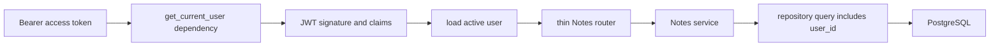

# Phase 2 — Authentication and Ownership

This phase turns the Notes API from a single shared notebook into a multi-user system. Build it only after Phase 1 runs against PostgreSQL and its tests are green.

## Outcome, prerequisites, and non-goals

By the checkpoint, a person can register, log in, refresh a session, log out, inspect and edit a safe profile, and access only their own Notes. Passwords are hashed with Argon2id. API requests use short-lived signed JWT access tokens. Browser sessions use rotating, opaque refresh tokens whose hashes—not raw tokens—are stored in PostgreSQL.

Prerequisites: the Phase 1 FastAPI application, synchronous SQLAlchemy 2 sessions, Alembic, the common error envelope, PostgreSQL integration-test fixtures, and all five Notes endpoints. Make a database backup if Phase 1 contains data you care about.

Non-goals: social login, email verification, password reset, MFA, organizations, administrator roles, API keys, and distributed key rotation. Record those as future work. Authentication is security-sensitive; this phase is a learning implementation, not a claim of a completed security review.

## 1. Concepts to learn before coding

**Authentication** answers “who is this caller?” **Authorization** answers “may that caller operate on this resource?” Login solves only the first question. Every owner-scoped query must solve the second.

A password hash is a deliberately expensive, salted, one-way verifier. Encryption is reversible and is wrong for passwords. Use a maintained password library; do not invent cryptography. `pwdlib`'s recommended hasher currently uses Argon2, and FastAPI's security tutorial also recommends Argon2.

A JWT access token is signed, not secret. A holder can read its claims, so put no password, provider token, or private note in it. Its signature detects modification. Its short lifetime limits—but does not eliminate—the harm of theft. Validate an explicit algorithm allow-list plus `iss`, `aud`, `sub`, `exp`, `iat`, `jti`, and a private `token_type="access"` claim. Never choose the verification algorithm from untrusted token input.

The refresh token is different: generate 32 random bytes, return the opaque value only in a protected cookie, and store a SHA-256 hash. SHA-256 is acceptable here because the input is high-entropy random data; it is not acceptable for passwords. Rotate the token on every refresh. Reuse of an already rotated token revokes its session family and forces login.

Cookies are sent by browsers automatically, which creates cross-site request forgery risk. For a same-site frontend, use `HttpOnly`, `Secure` outside local development, `SameSite=Lax`, a narrow `Path=/api/v1/auth`, and verify `Origin` on refresh/logout. A genuinely cross-site frontend needs `SameSite=None; Secure` and an explicit CSRF token design such as a double-submit cookie/header. CORS controls browser reading; it is not authorization or CSRF protection.

## 2. Request flow and boundaries



The router extracts HTTP inputs. `get_current_user` validates credentials. The service owns use-case rules and commit/rollback. Repositories construct SQL and may `flush()`, but never commit. The shared exception layer converts domain exceptions into the existing `{error: {code, message, details, request_id}}` contract.

Do not make a global “current user.” It is request data. Pass `current_user.id` explicitly into services and repositories; this keeps ownership visible in tests.

## 3. Dependency and configuration additions

Add these exact compatible ranges to the existing `[project].dependencies`, then reinstall with `python -m pip install -e ".[dev]"`:

```toml
"pwdlib[argon2]>=0.3,<1",
"PyJWT>=2.10,<3",
"email-validator>=2.2,<3",
```

`pwdlib` performs Argon2id hashing, `PyJWT` signs and verifies access JWTs, and `email-validator` supports Pydantic's `EmailStr`. Preserve your lock or frozen environment after installation.

Add settings; generate a development key with `python -c "import secrets; print(secrets.token_urlsafe(48))"` and never commit it:

```dotenv
APP_JWT_SECRET=CHANGE_ME_TO_A_LONG_RANDOM_VALUE
APP_JWT_ISSUER=personal-ai-workspace-api
APP_JWT_AUDIENCE=personal-ai-workspace-client
APP_ACCESS_TOKEN_TTL_MINUTES=15
APP_REFRESH_TOKEN_TTL_DAYS=30
APP_REFRESH_COOKIE_NAME=aiw_refresh
APP_COOKIE_SECURE=false
APP_ALLOWED_BROWSER_ORIGINS=["http://localhost:3000"]
```

Production must use a separately managed secret, HTTPS, `APP_COOKIE_SECURE=true`, and an explicit key-rotation procedure. Fail startup if the production secret is missing, short, or a documented placeholder.

## 4. Folder changes and why they exist

```text
app/
├── core/security.py                 # password, random-token, JWT primitives
├── modules/auth/
│   ├── model.py                     # User and AuthSession ORM mappings
│   ├── schemas.py                   # public auth/profile contracts
│   ├── repository.py                # users and refresh-session SQL
│   ├── service.py                   # register/login/rotate/revoke use cases
│   ├── dependencies.py              # AuthService and get_current_user wiring
│   └── router.py                    # /auth and /users/me HTTP boundary
└── modules/notes/
    ├── model.py                     # add user_id
    └── repository.py                # all row queries become owner-scoped
tests/
├── unit/auth/                       # pure password/JWT/service behavior
└── integration/api/test_auth.py     # cookies, DB sessions, ownership contracts
```

Keep low-level cryptographic operations in `core/security.py`, but keep refresh rotation policy in `auth/service.py`. “Core” must not become a bag of business rules. Create `__init__.py` in the new package.

## 5. Tables, constraints, and migration sequence

### `users`

- `id UUID PRIMARY KEY`
- `email VARCHAR(320) NOT NULL`; save `strip().casefold()` under this project's documented email-identity rule
- unique index on normalized `email`
- `password_hash TEXT NOT NULL`; never return or log it
- `display_name VARCHAR(100) NOT NULL`, nonblank
- `is_active BOOLEAN NOT NULL DEFAULT true`
- timezone-aware `created_at` and `updated_at`

### `auth_sessions`

- `id UUID PRIMARY KEY` and `family_id UUID NOT NULL`
- `user_id UUID NOT NULL REFERENCES users(id) ON DELETE CASCADE`
- `token_hash CHAR(64) NOT NULL UNIQUE`
- `expires_at TIMESTAMPTZ NOT NULL`
- nullable `rotated_at`, `revoked_at`, and `reuse_detected_at`; nullable `replaced_by_id UUID REFERENCES auth_sessions(id)` records the rotation link
- `created_at TIMESTAMPTZ NOT NULL`; optional safe device label, but no raw user-agent dump
- indexes on `(user_id, revoked_at)` and `family_id`

The cookie can contain `<session_uuid>.<random_secret>`. The UUID locates a row; compare the stored hash to `sha256(secret)` using `hmac.compare_digest`. A refresh transaction locks that row with `SELECT ... FOR UPDATE`, validates it, creates its replacement, marks the old row rotated, and commits once.

### Notes ownership migration

Use three reviewable Alembic revisions rather than one giant change:

1. Create `users`, then create `auth_sessions` with indexes and foreign keys.
2. Add nullable `notes.user_id`, plus index `(user_id, created_at DESC, id DESC)`. For a disposable local database, require the Notes table to be empty. For retained data, create/select a real owner and backfill explicitly; never silently assign rows to the first user.
3. assert no null `user_id`, alter it `NOT NULL`, and add `FOREIGN KEY ... REFERENCES users(id) ON DELETE CASCADE`.

Run `alembic upgrade head`, inspect constraints with `\d users`, `\d auth_sessions`, and `\d notes`, then rebuild the test database from zero. Review autogenerated migrations: Alembic cannot decide safe data backfills for you.

## 6. Endpoint contract worksheets

All errors use the shared envelope. Validation failures remain `422 REQUEST_VALIDATION_FAILED`. Responses containing credentials add `Cache-Control: no-store`. Protected routes accept `Authorization: Bearer <access-token>`. Unless a worksheet overrides it, a JSON success has `Content-Type: application/json` and the application's request-ID header, sets no cookie, and has no endpoint-specific `Location`; a `204` has an empty body and only normal non-content headers.

Normative public responses use UTC RFC 3339 timestamps and no extra fields:

- `UserPublic` is exactly `{id: UUID, email: EmailStr, display_name: string 1..100, is_active: boolean, created_at: AwareDatetime, updated_at: AwareDatetime}`. Password hashes, session IDs, throttle keys, and token claims never appear.
- `AccessTokenPublic` is exactly `{access_token: string 1..4096, token_type: "bearer", expires_in: integer 1..900}`; login adds `user: UserPublic`, while refresh returns only these three token fields. The configured TTL supplies `expires_in`; do not decode the newly created JWT to rediscover it.
- The refresh cookie is named by the server (use `aiw_refresh` locally), contains `<session_uuid>.<random_secret>`, and is set/cleared with `HttpOnly`, `SameSite=Lax`, `Path=/api/v1/auth`, no `Domain`, and `Secure` outside local development. Set a matching `Max-Age`/`Expires`; clearing repeats the exact name/path/domain/security attributes with `Max-Age=0`.

### 6.1 Register

- **Purpose:** create one account and make password storage safe.
- **Method/path/auth:** `POST /api/v1/auth/register`; public. The local learning slice has no limiter yet; the mandatory distributed gateway/application limiter is implemented before public exposure in Phase 11's “Production auth-throttling build slice.”
- **Path/query parameters:** none.
- **Body:** `email: EmailStr` required and at most 320 characters after normalization; `password: str` required, 12–128 characters; `display_name: str` required, trimmed, 1–100 characters. No nullable fields; reject unknown and server-owned fields.
- **Success:** `201 Created`; body `UserPublic`; `Cache-Control: no-store` and standard JSON/request-ID headers. There is no `Location` because Phase 2 intentionally exposes no canonical `GET /users/{id}`. It does not log in automatically.
- **Errors:** duplicate normalized email `409 EMAIL_ALREADY_REGISTERED`; weak/oversized password or invalid field `422 REQUEST_VALIDATION_FAILED`; after Phase 11 hardening, `429 AUTH_RATE_LIMITED` or fail-closed `503 AUTH_THROTTLE_UNAVAILABLE`, both with the documented `Retry-After` policy.
- **Tables/transaction/side effects:** check/insert `users`; Argon2 work occurs before the short insert transaction; service commits once. A uniqueness race is translated from the named database constraint.
- **Tests:** normalization and duplicate; hash differs from password and verifies; password boundaries; safe response excludes hash; concurrent duplicate yields one account and one `409`.

### 6.2 Login

- **Purpose:** verify credentials, issue an access token, and create a refresh session.
- **Method/path/auth:** `POST /api/v1/auth/login`; public; JSON body rather than OAuth form because this is an application-specific session endpoint.
- **Path/query parameters:** none.
- **Body:** `email: EmailStr` at most 320 characters and `password: string` 1–128, both required/non-null; reject unknown fields. A short password is still processed through the same generic credential failure path rather than a revealing validation rule.
- **Success:** `200 OK`; `AccessTokenPublic` plus `user: UserPublic`; the exact refresh `Set-Cookie` above; `Cache-Control: no-store`.
- **Errors:** wrong email, wrong password, or inactive account all expose `401 INVALID_CREDENTIALS` with `WWW-Authenticate: Bearer`; after the mandatory Phase 11 hardening slice, excessive register/login attempts return `429 AUTH_RATE_LIMITED` with an integer `Retry-After`, and an indeterminate shared-limiter decision fails closed as `503 AUTH_THROTTLE_UNAVAILABLE` with `Retry-After: 5`.
- **Tables/transaction/side effects:** select `users`, perform real or dummy Argon2 verification, insert `auth_sessions`, commit. Raw credentials/tokens never enter logs.
- **Tests:** success and cookie flags; wrong email/password have identical public error; inactive account; dummy hash path executes; session stores only hash; access claims and expiration validate.

### 6.3 Rotate refresh token

- **Purpose:** exchange one valid refresh cookie for a new access token and a one-use replacement refresh token.
- **Method/path/auth:** `POST /api/v1/auth/refresh`; cookie-authenticated; no body; require an allowed `Origin` for browser requests.
- **Path/query parameters:** none.
- **Success:** `200 OK`; `AccessTokenPublic`; the exact replacement `Set-Cookie`; `Cache-Control: no-store`.
- **Errors:** missing/malformed/expired/revoked token `401 INVALID_REFRESH_TOKEN`; old rotated-token reuse `401 REFRESH_TOKEN_REUSED` after revoking its family; disallowed origin `403 CSRF_CHECK_FAILED`.
- **Tables/transaction/side effects:** lock old `auth_sessions` row; validate hash/status/user; insert replacement and mark old rotated in one transaction. Reuse detection revokes all active family rows in a separate completed transaction before returning the error.
- **Tests:** normal rotation; old token rejected; replacement works; expiry/revocation; hash mismatch; two concurrent rotations allow only one; reuse revokes family; origin rules.

### 6.4 Logout

- **Purpose:** revoke the current refresh session and clear its cookie.
- **Method/path/auth:** `POST /api/v1/auth/logout`; refresh cookie if present; allowed-origin check.
- **Body:** none.
- **Path/query parameters:** none.
- **Success:** always `204 No Content`; expired `Set-Cookie` clears the same name/path; no response body.
- **Errors:** disallowed origin `403 CSRF_CHECK_FAILED`; otherwise missing, invalid, or already revoked cookie remains an idempotent `204`.
- **Tables/transaction/side effects:** locate/lock `auth_sessions` when possible, set `revoked_at`, commit, clear cookie.
- **Tests:** valid logout prevents refresh; cookie cleared; repeated/missing-cookie logout is `204`; origin rejected.

### 6.5 Read current profile

- **Purpose:** return the authenticated user's safe profile.
- **Method/path/auth:** `GET /api/v1/users/me`; bearer access token required.
- **Path/query parameters and body:** none.
- **Success:** `200 OK`; exactly `UserPublic`.
- **Errors:** missing/malformed/expired/wrong issuer or audience token `401 INVALID_ACCESS_TOKEN` with `WWW-Authenticate: Bearer`; inactive/deleted subject `401 INVALID_ACCESS_TOKEN`.
- **Tables/transaction/side effects:** select `users`; read-only, no commit.
- **Tests:** valid and each invalid-claim case; response excludes password/session data.

### 6.6 Update current profile

- **Purpose:** change safe mutable profile fields.
- **Method/path/auth:** `PATCH /api/v1/users/me`; bearer required.
- **Path/query parameters:** none.
- **Body:** currently only `display_name`, present and non-null when supplied, trimmed 1–100; reject an empty object and unknown fields. Email/password/activity are intentionally immutable here.
- **Success:** `200 OK`; updated `UserPublic`.
- **Errors:** token failures `401 INVALID_ACCESS_TOKEN`; empty patch `422 EMPTY_UPDATE`; invalid field `422 REQUEST_VALIDATION_FAILED`.
- **Tables/transaction/side effects:** select/update `users`; service commits and refreshes.
- **Tests:** rename; whitespace/length; empty and unknown fields; another user's row unchanged.

### 6.7 Ownership changes for every Notes endpoint

These are not new URLs, but their contracts change, so treat each as endpoint work. `NoteRead` remains `{id,title,content,created_at,updated_at}` and never exposes `user_id`. All require a bearer token and forbid unknown JSON fields.

**Create Note — `POST /api/v1/notes`:** no path/query parameters. Body is non-null `title` trimmed 1–200 and optional nullable `content` with the Phase 1 maximum; omission and explicit null both create null content. Success is `201`, `Location: /api/v1/notes/{id}`, standard JSON/request-ID headers, and `NoteRead`. Errors are `401 INVALID_ACCESS_TOKEN`, `422 REQUEST_VALIDATION_FAILED`, and any named Phase 1 database conflict (do not invent a generic conflict for an impossible state). Insert `notes.user_id=current_user.id`; service commits/refreshes. Test field boundaries, header/body, owner assignment from the token, and absence of user/hash data.

**List Notes — `GET /api/v1/notes`:** no body. Keep the documented Phase 1 pagination constraints and deterministic ordering; query parameters never include `user_id`. Success is `200`, the documented page/list body, and standard JSON/request-ID headers. Errors are `401 INVALID_ACCESS_TOKEN` and invalid pagination `422 REQUEST_VALIDATION_FAILED`. Run only `SELECT ... WHERE user_id=:owner`; no commit/side effect. Seed two users and test count, order, every page, and isolation.

**Retrieve Note — `GET /api/v1/notes/{note_id}`:** UUID path, no query/body. Success is `200 NoteRead` with standard JSON/request-ID headers. Errors are `401 INVALID_ACCESS_TOKEN`, malformed UUID `422 REQUEST_VALIDATION_FAILED`, and missing **or foreign** row `404 NOTE_NOT_FOUND`. Query by both `id` and `user_id`; read-only. Test owned, missing, malformed, and foreign IDs.

**Patch Note — `PATCH /api/v1/notes/{note_id}`:** UUID path, no query. Body must contain at least one of non-null `title` with its Phase 1 constraints or nullable `content`; omitted means preserve, explicit content null means clear, and unknown fields are rejected. Success is `200 NoteRead` plus standard JSON/request-ID headers. Errors are `401 INVALID_ACCESS_TOKEN`, validation/empty update `422 REQUEST_VALIDATION_FAILED`, and missing/foreign `404 NOTE_NOT_FOUND`. Owner-scoped select/update and one service commit/refresh. Test every omission/null case, rollback, and that Bob cannot mutate Alice.

**Delete Note — `DELETE /api/v1/notes/{note_id}`:** UUID path, no query/body. Success is an empty `204` with the standard request-ID header. Errors are `401 INVALID_ACCESS_TOKEN`, malformed UUID `422 REQUEST_VALIDATION_FAILED`, and missing/foreign `404 NOTE_NOT_FOUND`. Owner-scoped delete plus one service commit; no other side effect. Test deletion, foreign protection, and repeated-delete policy.

Do not load a Note by ID and check ownership afterward. The repository signature itself should make the safe path natural: `get_by_id(owner_id, note_id)`.

## 7. Build vertical slices

### Slice A — Password and JWT primitives

Write pure functions first and test them without FastAPI or PostgreSQL:

```python
from datetime import UTC, datetime, timedelta
from hashlib import sha256
import secrets

import jwt
from pwdlib import PasswordHash

password_hash = PasswordHash.recommended()


def hash_password(password: str) -> str:
    return password_hash.hash(password)


def make_refresh_secret() -> str:
    return secrets.token_urlsafe(32)


def digest_refresh_secret(secret: str) -> str:
    return sha256(secret.encode("utf-8")).hexdigest()


def issue_access_token(*, user_id: str, secret: str, issuer: str, audience: str) -> str:
    now = datetime.now(UTC)
    claims = {
        "sub": user_id,
        "iss": issuer,
        "aud": audience,
        "iat": now,
        "exp": now + timedelta(minutes=15),
        "jti": secrets.token_hex(16),
        "token_type": "access",
    }
    return jwt.encode(claims, secret, algorithm="HS256")
```

The verification function must pass `algorithms=["HS256"]`, required claims, issuer, and audience to `jwt.decode`; catch the library's token exceptions and raise your domain `InvalidAccessToken`. Keep library exceptions out of routers.

### Slice B — Register, then login

Create ORM models and the first migration. Write schemas with `ConfigDict(extra="forbid")`. Implement `UserRepository.get_by_email()` and `.add()`; then `AuthService.register()`. Catch only the named uniqueness constraint at the service/exception boundary—do not turn every `IntegrityError` into “duplicate email.” Add login only after register is green.

If an email is absent at login, verify the submitted password against one precomputed dummy Argon2 hash. That narrows timing differences without creating a new expensive dummy hash per request.

### Slice C — Current-user dependency

Use FastAPI's `HTTPBearer(auto_error=False)` to extract the bearer credential and describe bearer security in OpenAPI. This phase's login accepts application-specific JSON, so declaring an OAuth2 password flow with `OAuth2PasswordBearer` would make Swagger send a form that does not match the contract. If you later need OAuth2 client interoperability, add a standards-compliant token endpoint deliberately. Decode claims, parse `sub` as UUID, load an active user, then return a safe domain/ORM user object. Never commit in the dependency.

### Slice D — Rotation and logout

Implement token parsing, row locking, constant-time digest comparison, rotation, then reuse handling. Inject a `Clock` and token generator into the service so tests do not sleep or depend on random values. Set and clear the cookie in the router because cookie flags are HTTP policy; keep rotation rules in the service.

### Slice E — Notes migration and isolation

Write a failing test with Alice and Bob before changing Notes. Add `owner_id` to repository methods, service methods, dependency wiring, and route calls. Search the module with `rg "NoteRepository|session.get\(Note"` to find unsafe direct lookups. Only then make `notes.user_id` non-null.

## 8. Security and transaction rules

- Service methods own commit and rollback. Repository methods may `flush()` to obtain IDs.
- Never keep an authentication transaction open during Argon2 work if no row lock is needed.
- Lock a refresh row during rotation; database uniqueness and locks settle races, not an in-process Python lock.
- Never log authorization headers, cookies, passwords, hashes, JWTs, signing keys, or request bodies on auth routes.
- Return a generic credential error and complete Phase 11's distributed gateway/application auth-throttling slice before Internet exposure; a process-local counter is not sufficient for replicas or restarts.
- Access-token logout is not instant revocation: a stolen access token remains valid until expiry. Short lifetime is the Phase 2 tradeoff.
- Treat UUIDs as identifiers, not permissions. Ownership belongs in the SQL predicate.
- Use TLS in every non-local environment.

## 9. Test strategy

**Unit tests:** password hash/verify; refresh digest determinism; JWT happy path and exp/iss/aud/type failures; register normalization; service rollback; rotation state table; dummy verification; profile patch rules. Inject a fixed clock.

**PostgreSQL integration tests:** migration from an empty Phase 1 schema; unique normalized email; session foreign keys/cascade; concurrent refresh using two independent sessions; owner-scoped repository SQL; rollback on a named constraint.

**HTTP contract tests:** all worksheets above, exact status/header/body shape, `Set-Cookie` flags, `Cache-Control`, `WWW-Authenticate`, request IDs, no credential leakage, and Alice/Bob isolation across all Notes operations. Use `TestClient`'s separate cookie jars for two users.

Do not replace PostgreSQL with SQLite: constraint, lock, UUID, and concurrency behavior are part of this phase.

## 10. Manual exercise and debugging

Start Uvicorn, then use a cookie jar:

```bash
curl -i -c alice.cookies -H 'Content-Type: application/json' \
  -d '{"email":"alice@example.com","password":"correct horse battery","display_name":"Alice"}' \
  http://127.0.0.1:8000/api/v1/auth/register

curl -i -c alice.cookies -H 'Content-Type: application/json' \
  -d '{"email":"alice@example.com","password":"correct horse battery"}' \
  http://127.0.0.1:8000/api/v1/auth/login
```

Copy the returned access token into a shell variable only for this local session, call `/users/me`, then create a Note. Register Bob with a separate `bob.cookies` jar and request Alice's Note ID; expect `404`, not `403`. Refresh with `-b alice.cookies -c alice.cookies` and an allowed `Origin` header. Retry the old cookie copy to exercise reuse detection. Do not paste real tokens into your learning journal.

When debugging, follow evidence in order: request ID → HTTP status/error code → application log event without secrets → decoded but **untrusted** JWT claims → database session row state → SQL owner predicate. A decoded JWT is not verified. For cookie bugs, inspect domain/path/SameSite/Secure and the exact jar, not only backend code.

## 11. Exercises

1. Draw the state table for active, rotated, expired, revoked, and reused refresh sessions.
2. Explain why plain SHA-256 is safe for a 256-bit random refresh secret but unsafe for a human password.
3. Add a test that changes `aud` without resigning, and another that signs a token with the wrong valid key.
4. Trigger two refresh requests simultaneously and explain the row-lock result.
5. Write the unsafe Note query, make the isolation test fail, then repair it with an owner predicate.
6. Write an ADR comparing cookie refresh tokens with returning both tokens to JavaScript.
7. Add a test proving auth logs contain neither a submitted password nor a cookie value.

## 12. Checkpoint

You are finished only when migrations rebuild a clean database; all six auth/profile endpoints meet their worksheets; rotation and reuse tests pass; two separate browser cookie jars work; every Notes repository operation requires `owner_id`; Alice cannot list/read/change/delete Bob's rows; secrets are absent from responses and logs; and the full suite passes against PostgreSQL.

## What you should be able to explain after Phase 2

- Authentication versus authorization and `401` versus `403` versus privacy-preserving `404`.
- Argon2id password hashing versus encryption, refresh-token digesting, and constant-time comparison.
- JWT signature, readable claims, algorithm allow-list, issuer, audience, subject, expiry, and key entropy.
- Access-token lifetime versus rotating refresh-session lifetime and what logout can revoke.
- Cookie flags, CORS, SameSite, Origin checking, and when a separate CSRF token is required.
- Why row locks and database constraints resolve concurrent rotation.
- Why `WHERE id=:id AND user_id=:user_id` is safer than an after-load ownership check.
- Why the service, not router or repository, owns a transaction.

## Official reading

- [FastAPI: OAuth2 with password hashing and JWT](https://fastapi.tiangolo.com/tutorial/security/oauth2-jwt/)
- [FastAPI security tools: `HTTPBearer`](https://fastapi.tiangolo.com/reference/security/#fastapi.security.HTTPBearer)
- [pwdlib reference and recommended password hasher](https://frankie567.github.io/pwdlib/reference/pwdlib/)
- [PyJWT usage documentation](https://pyjwt.readthedocs.io/en/stable/usage.html)
- [RFC 7519: JSON Web Token](https://www.rfc-editor.org/rfc/rfc7519)
- [RFC 8725: JWT Best Current Practices](https://www.rfc-editor.org/rfc/rfc8725)
- [OWASP Password Storage Cheat Sheet](https://cheatsheetseries.owasp.org/cheatsheets/Password_Storage_Cheat_Sheet.html)
- [OWASP CSRF Prevention Cheat Sheet](https://cheatsheetseries.owasp.org/cheatsheets/Cross-Site_Request_Forgery_Prevention_Cheat_Sheet.html)
- [MDN: Set-Cookie attributes](https://developer.mozilla.org/en-US/docs/Web/HTTP/Headers/Set-Cookie)
- [SQLAlchemy Session transaction management](https://docs.sqlalchemy.org/en/20/orm/session_transaction.html)
- [PostgreSQL explicit locking](https://www.postgresql.org/docs/current/explicit-locking.html)

Read with a question: write the claim or cookie rule you plan to implement, find the primary paragraph that defines it, test one failure case, and record the decision in your own words. Security defaults and libraries change, so re-check these pages before deployment.
