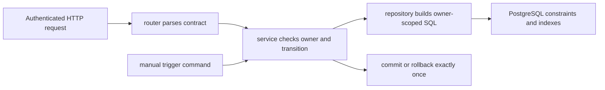

# Phase 3 — Tasks, Reminders, and Time

Phase 3 adds useful planning data while teaching relationships, state machines, time zones, filtering, stable pagination, and the first safe “work is due” query. It deliberately does not send Telegram, email, Slack, or any other notification.

## Outcome, prerequisites, and non-goals

At the checkpoint, authenticated users can create, list, read, partially update, and delete Tasks and Reminders. A Reminder may stand alone or refer to one owned Task. Timestamps represent real instants, the original IANA zone is retained, valid state transitions are enforced, and a manually invoked service atomically marks due schedules as triggered.

Prerequisites: completed Phases 0–2, including `get_current_user`, owner-scoped Notes, PostgreSQL integration tests, request IDs, the common error envelope, and the rule that services own transactions.

Non-goals: recurring schedules, natural-language time parsing, a durable queue, an always-running scheduler, retries, notification channels, or proof of external delivery. Future phases will add `notification_deliveries` and worker jobs. “Triggered” in this phase means the schedule became due and was claimed—not that a person received anything.

## 1. Beginner concepts

A **foreign key** says that a value must refer to an existing parent. It does not automatically say the parent belongs to the same user; the service must look up the Task with both task ID and owner ID before linking it.

A **state machine** is a set of allowed states and transitions. It prevents vague booleans such as `is_done` plus `is_cancelled` from producing impossible combinations. Draw the transition table before writing `if` statements.

An **instant** is one point on the global timeline. A **wall time** is what a clock showed in a region. `2026-11-01 01:30` in New York can be ambiguous during the daylight-saving transition, while `2026-11-01T05:30:00Z` is one unambiguous instant. This API accepts only offset-aware timestamps and stores them as PostgreSQL `TIMESTAMPTZ`. It also saves an IANA name such as `America/New_York` for future display and recurrence decisions.

PostgreSQL normalizes timezone-aware timestamps internally and renders them in the database session's zone. It does not preserve the submitted zone name, which is why `time_zone` is a separate column. A numeric offset such as `+05:30` is not an IANA zone: offsets do not contain future political or daylight-saving rules.

An index is an additional lookup structure with write/storage cost. Add one for a query you can name, then inspect `EXPLAIN`. Stable pagination needs a total order: `(created_at DESC, id DESC)` or `(remind_at ASC, id ASC)`, not time alone.

## 2. Architecture and request flow



Tasks and Reminders are sibling feature modules because each has its own resource contract. The Reminders service may call a Task repository to validate a link; the router must not perform that lookup. The manual command calls the same service without importing FastAPI.

## 3. Dependency and configuration additions

Add one runtime dependency and reinstall:

```toml
"tzdata>=2025.2,<2027",
```

Python's `zoneinfo` uses operating-system time-zone data when available and falls back to the first-party `tzdata` package. Declaring it makes local, CI, and future container behavior less platform-dependent. Before locking, check the current release and Python compatibility.

Add limits to settings rather than scattering magic numbers:

```dotenv
APP_DEFAULT_PAGE_SIZE=20
APP_MAX_PAGE_SIZE=100
APP_MAX_DUE_BATCH_SIZE=100
```

Do not add Redis, Celery, APScheduler, or a worker yet. The purpose of this phase is to understand database state before adding distributed execution.

## 4. Folder changes and rationale

```text
app/modules/
├── tasks/
│   ├── model.py              # Task row and constrained values
│   ├── schemas.py            # create/update/read/list contracts
│   ├── repository.py         # owned lookups, filters, keyset page
│   ├── service.py            # transitions and transaction ownership
│   ├── dependencies.py       # request-scoped TaskService
│   └── router.py             # /tasks HTTP boundary
└── reminders/
    ├── model.py              # Reminder row and schedule state
    ├── schemas.py            # time-aware external contracts
    ├── repository.py         # filters, locking due query
    ├── service.py            # links, snooze, trigger semantics
    ├── dependencies.py       # request service and Clock
    ├── router.py             # /reminders HTTP boundary
    └── commands/trigger_due.py # manual non-HTTP composition root
tests/unit/{tasks,reminders}/
tests/integration/api/{test_tasks.py,test_reminders.py}
tests/integration/repositories/test_due_reminders.py
```

The command is a thin composition root: obtain a Session, construct repositories/service, call `trigger_due`, log counts, and exit. It contains no schedule rules. A `Clock` protocol belongs near the service so tests can supply a fixed time.

## 5. Data model, constraints, and transitions

### `tasks`

- `id UUID PRIMARY KEY`; `user_id UUID NOT NULL REFERENCES users(id) ON DELETE CASCADE`
- `title VARCHAR(200) NOT NULL`, with the same non-whitespace rule as Notes
- nullable `description TEXT`, API-limited to 20,000 characters
- `status VARCHAR(20) NOT NULL`: `todo`, `in_progress`, `completed`, or `cancelled`
- `priority VARCHAR(10) NOT NULL`: `low`, `normal`, `high`, or `urgent`
- nullable `due_at TIMESTAMPTZ` and `completed_at TIMESTAMPTZ`
- timezone-aware `created_at`, `updated_at`
- check constraints for enumerated strings and `(status='completed') = (completed_at IS NOT NULL)`
- index `(user_id, created_at DESC, id DESC)` and optional partial due index after measuring

Allowed Task transitions:

| From | To |
|---|---|
| `todo` | `in_progress`, `completed`, `cancelled` |
| `in_progress` | `todo`, `completed`, `cancelled` |
| `completed` | none in Phase 3 |
| `cancelled` | none in Phase 3 |

The service sets `completed_at=clock.now()` when entering `completed`. Clients cannot forge it. Terminal Tasks remain readable and deletable; reopening is a future explicit command if you genuinely need it.

### `reminders`

- `id UUID PRIMARY KEY`; `user_id` with user cascade
- nullable `task_id UUID REFERENCES tasks(id) ON DELETE SET NULL`
- `message VARCHAR(1000) NOT NULL`, nonblank
- `remind_at TIMESTAMPTZ NOT NULL`
- `time_zone VARCHAR(100) NOT NULL`, validated by `ZoneInfo`
- `status VARCHAR(16) NOT NULL`: `scheduled`, `triggered`, or `cancelled`
- nullable `triggered_at TIMESTAMPTZ`; timestamps
- check: `triggered_at IS NOT NULL` exactly when status is `triggered`
- due index `(status, remind_at ASC, id ASC)` and user-list index `(user_id, remind_at ASC, id ASC)`

Allowed schedule transitions are `scheduled -> triggered` (only the due service) and `scheduled -> cancelled` (user patch). Triggered and cancelled are terminal. Snoozing changes `remind_at` while remaining scheduled.

The Task FK becomes null if a Task is deleted, preserving a useful standalone Reminder. Task ownership is immutable; when creating or relinking, the service selects the Task with `WHERE id=:task_id AND user_id=:user_id`. A foreign Task looks absent.

### Future, intentionally absent data

Do not add `delivered` or `failed` to Reminder status. A later `notification_deliveries` row will hold per-channel states such as `queued`, `sending`, `delivered`, `failed`, and `dead_letter`. Schedule state and delivery state answer different questions.

## 6. Migration sequence

1. Create `tasks` with named check constraints, FK, and list index. Run upgrade/downgrade/upgrade.
2. Create `reminders` with named constraints and indexes. Verify `ON DELETE SET NULL` manually.
3. Seed enough local due rows to run `EXPLAIN (ANALYZE, BUFFERS)` on `WHERE status='scheduled' AND remind_at <= :now ORDER BY remind_at,id LIMIT :limit`. Avoid drawing conclusions from a nearly empty table.

Import both models in Alembic's metadata path before generating. Autogenerate can see columns but cannot invent transition semantics or decide the correct delete policy. Review SQL with `alembic upgrade head --sql` when useful.

## 7. Shared schema and pagination decisions

Use Pydantic 2 `AwareDatetime` to reject naive timestamps and `extra="forbid"` to catch misspelled fields. Normalize accepted values to UTC before the service persists them. Validate IANA keys by constructing `ZoneInfo(value)` and translate `ZoneInfoNotFoundError` into a field validation error. In the service, also require the submitted numeric offset on `remind_at` to equal the offset produced by `ZoneInfo(time_zone)` for that same instant. This makes the zone an honest description of the submitted local time and lets an explicit offset distinguish the two occurrences of an ambiguous fall-back wall time. Return `422 TIME_ZONE_OFFSET_MISMATCH` when they disagree.

```python
from datetime import UTC, datetime
from uuid import UUID
from zoneinfo import ZoneInfo, ZoneInfoNotFoundError

from pydantic import AwareDatetime, BaseModel, ConfigDict, field_validator


class ReminderCreate(BaseModel):
    model_config = ConfigDict(extra="forbid")

    message: str
    remind_at: AwareDatetime
    time_zone: str
    task_id: UUID | None = None

    @field_validator("time_zone")
    @classmethod
    def valid_zone(cls, value: str) -> str:
        try:
            ZoneInfo(value)
        except (ZoneInfoNotFoundError, ValueError) as exc:
            raise ValueError("must be an IANA time-zone name") from exc
        return value


def as_utc(value: datetime) -> datetime:
    return value.astimezone(UTC)
```

Use an opaque unpadded base64url cursor of 1–2,048 ASCII characters whose decoded UTF-8 JSON is at most 512 bytes. Its exact object is `{"v":1,"kind":"tasks"|"reminders","filters_sha256":"<64 lowercase hex>","last":{"at":"<UTC RFC3339>","id":"<canonical UUID>"}}`; no other keys are allowed. For Tasks, `at` is `created_at`, `kind=tasks`, ordering is `(created_at DESC,id DESC)`, and the next predicate is tuple `<`. For Reminders, `at` is `remind_at`, `kind=reminders`, ordering is `(remind_at ASC,id ASC)`, and the next predicate is tuple `>`. Build the fingerprint from canonical compact sorted-key JSON of the endpoint's normalized filters, representing omitted filters as null and timestamps in UTC: Task keys are exactly `status,priority,due_after,due_before`; Reminder keys are exactly `status,task_id,from_at,to_at`. `limit` is excluded so page size may change safely. A missing cursor is valid; a non-string, empty, overlong, padded, or non-base64url value is `422 REQUEST_VALIDATION_FAILED`. Once the bounded string passes that surface schema, invalid UTF-8/JSON, unknown/missing keys, unsupported version/kind, invalid timestamp/UUID/hash, trailing data, or a fingerprint/kind mismatch is `400 INVALID_CURSOR`. Sign it later if tampering matters; today strict decoding makes it input, not authority. A page response is `{items: [...], next_cursor: string|null}` and every cursor is exclusive.

### Normative response vocabulary

Every timestamp is an offset-aware UTC RFC 3339 string with `Z`; every ID is a UUID string. Every listed key is always present and only fields typed `| null` may be JSON null. No response has additional keys until a versioned contract change.

- **`TaskPublic`:** `id: UUID`; `title: string` 1–200; `description: string 0–20,000 | null`; `status: "todo"|"in_progress"|"completed"|"cancelled"`; `priority: "low"|"normal"|"high"|"urgent"`; `due_at: datetime | null`; `completed_at: datetime | null`; `created_at: datetime`; `updated_at: datetime`. `completed_at` is non-null exactly when status is `completed`.
- **`ReminderPublic`:** `id: UUID`; `task_id: UUID | null`; `message: string` 1–1,000; `remind_at: datetime`; `time_zone: IANA zone string` 1–100; `status: "scheduled"|"triggered"|"cancelled"`; `triggered_at: datetime | null`; `created_at: datetime`; `updated_at: datetime`. `triggered_at` is non-null exactly when status is `triggered`.
- **`TaskPage`:** `items: array[TaskPublic]` of 0–100 values in `(created_at DESC,id DESC)` order; `next_cursor: string 1–2,048 | null`.
- **`ReminderPage`:** `items: array[ReminderPublic]` of 0–100 values in `(remind_at ASC,id ASC)` order; `next_cursor: string 1–2,048 | null`.

Neither object exposes `user_id`. Endpoint references to “full Task,” “full Reminder,” or a page mean exactly these schemas.

## 8. Endpoint contract worksheets

Every route requires a bearer access token. Missing/invalid auth is `401 INVALID_ACCESS_TOKEN`. A well-formed foreign ID returns the same resource-specific `404` as a missing ID. All bodies reject unknown fields. Unless a worksheet overrides it, a JSON success includes `Content-Type: application/json` plus the application's request-ID header and no endpoint-specific headers; each create additionally has the stated `Location`, and every `204` has an empty body plus only normal non-content headers.

### Normative Phase 3 error vocabulary

Every error uses `{ "error": { "code", "message", "details", "request_id" } }`; `code` is exactly one value below. Common `401 INVALID_ACCESS_TOKEN`, `422 REQUEST_VALIDATION_FAILED`, and `500 INTERNAL_SERVER_ERROR` retain the meanings established earlier. `REQUEST_VALIDATION_FAILED` covers malformed UUID syntax, malformed JSON, wrong primitive types, unknown fields, invalid body enums/lengths, naive timestamps, and invalid IANA names unless a narrower code below applies.

| Status and code | Exact condition |
|---|---|
| `401 INVALID_ACCESS_TOKEN` | Missing, malformed, expired, or otherwise invalid bearer token. |
| `404 TASK_NOT_FOUND` | Addressed Task is missing/foreign, including a Task link the owner cannot resolve. |
| `404 REMINDER_NOT_FOUND` | Addressed Reminder is missing/foreign. |
| `409 INVALID_TASK_TRANSITION` | Requested Task state edge is not in the transition table. |
| `409 REMINDER_NOT_EDITABLE` | PATCH targets a triggered or cancelled Reminder. |
| `409 REMINDER_NOT_SNOOZABLE` | Snooze targets a triggered or cancelled Reminder. |
| `422 REQUEST_VALIDATION_FAILED` | Generic path/query/body parsing or schema failure described above. |
| `422 PAGE_LIMIT_INVALID` | `limit` is not an integer in `1..100`. |
| `400 INVALID_CURSOR` | Surface-valid cursor cannot be decoded semantically or does not match the current filters/order/version. |
| `422 TASK_FILTER_INVALID` | Task filter enum/time is malformed or `due_after >= due_before`. |
| `422 REMINDER_FILTER_INVALID` | Reminder filter enum/UUID/time is malformed or `from_at >= to_at`. |
| `422 EMPTY_UPDATE` | PATCH body contains none of the allowed mutable fields. |
| `422 REMIND_AT_MUST_BE_FUTURE` | A create, reschedule, or absolute snooze instant is not strictly after the injected clock. |
| `422 TIME_ZONE_OFFSET_MISMATCH` | Submitted numeric offset disagrees with the supplied IANA zone at that instant. |
| `422 REMINDER_CANCEL_WITH_EDITS` | `status=cancelled` is combined with another mutation. |
| `422 SNOOZE_INPUT_INVALID` | Snooze supplies both/neither forms, or supplies `time_zone` without absolute `remind_at`. |
| `500 INTERNAL_SERVER_ERROR` | Unclassified server defect; response is sanitized. |

Endpoint cards list every expected operation-specific code. Framework `405` and the sanitized `500` remain common protocol outcomes rather than being repeated in every card.

### 8.1 Create Task

- **Purpose/method/path:** create a Task; `POST /api/v1/tasks`.
- **Auth/parameters:** bearer owner required; no path/query parameters.
- **Body:** `title` required, trimmed 1–200; `description` optional nullable, max 20,000; `priority` optional default `normal`; `due_at` optional nullable `AwareDatetime`. Status always starts `todo`.
- **Success:** `201 Created`, `Location: /api/v1/tasks/{id}`, `TaskPublic` body.
- **Errors:** `401 INVALID_ACCESS_TOKEN`; `422 REQUEST_VALIDATION_FAILED`.
- **Tables/transaction/side effects:** insert owned `tasks`; service commits and refreshes; no external side effect.
- **Tests:** defaults, null description/due date, naive timestamp rejected, title/priority boundaries, owner assigned from token rather than body.

### 8.2 List Tasks

- **Purpose/method/path:** owner-scoped filtered page; `GET /api/v1/tasks`.
- **Auth/body:** bearer required; no request body.
- **Parameters:** optional non-null `status: todo|in_progress|completed|cancelled`; optional non-null `priority: low|normal|high|urgent`; optional non-null offset-aware RFC 3339 `due_before`/`due_after`; integer `limit` default 20 and range 1–100; optional non-null cursor satisfying Section 7. Time filters require `due_after < due_before` when both exist. The predicates are strict (`due_at > due_after` and `due_at < due_before`), and null due dates never match either bound.
- **Success:** `200 OK`, `TaskPage`.
- **Errors:** `401 INVALID_ACCESS_TOKEN`; `422 TASK_FILTER_INVALID`; `422 PAGE_LIMIT_INVALID`; `422 REQUEST_VALIDATION_FAILED` for cursor surface type/length/alphabet; `400 INVALID_CURSOR` for cursor decode/schema/filter mismatch.
- **Tables/transaction:** read `tasks` only; no commit.
- **Tests:** each/composed filter, exact-bound exclusion, null due dates excluded from due ranges, two-user isolation, ties on time, no duplicate/skip across pages.

### 8.3 Retrieve Task

- **Purpose/method/path:** read one owned Task; `GET /api/v1/tasks/{task_id}`.
- **Auth/parameters/body:** bearer required; UUID `task_id` path only; no query or body.
- **Success:** `200 OK`, `TaskPublic`.
- **Errors:** `401 INVALID_ACCESS_TOKEN`; `422 REQUEST_VALIDATION_FAILED` for malformed UUID; `404 TASK_NOT_FOUND`.
- **Tables/transaction:** owner-scoped `tasks` select; read-only.
- **Tests:** owned, missing, malformed, and foreign ID.

### 8.4 Patch Task

- **Purpose/method/path:** partial edit or state transition; `PATCH /api/v1/tasks/{task_id}`.
- **Auth/parameters:** bearer required; UUID `task_id`; no query parameters.
- **Body:** at least one of `title` non-null, `description` nullable, `priority` non-null, `due_at` nullable, `status` non-null. `completed_at` and ownership are forbidden.
- **Success:** `200 OK`, updated `TaskPublic`.
- **Errors:** `401 INVALID_ACCESS_TOKEN`; `404 TASK_NOT_FOUND`; `422 EMPTY_UPDATE`; `422 REQUEST_VALIDATION_FAILED`; `409 INVALID_TASK_TRANSITION`.
- **Tables/transaction:** owner-scoped select, transition, update, one service commit; entering completed uses the injected clock.
- **Tests:** every transition edge and forbidden edge; null clearing; completed timestamp; rollback leaves prior state intact.

### 8.5 Delete Task

- **Purpose/method/path:** permanently remove a Task; `DELETE /api/v1/tasks/{task_id}`.
- **Auth/parameters:** bearer required; UUID `task_id`; no query parameters.
- **Body/success:** no body; `204 No Content` and no response body.
- **Errors:** `401 INVALID_ACCESS_TOKEN`; `404 TASK_NOT_FOUND`; `422 REQUEST_VALIDATION_FAILED` for malformed UUID.
- **Tables/transaction/side effects:** delete `tasks`; database sets linked `reminders.task_id` null; commit once.
- **Tests:** deletion, foreign privacy, linked Reminder survives as standalone, repeated delete returns `404`.

### 8.6 Create Reminder

- **Purpose/method/path:** schedule a standalone or Task-linked reminder; `POST /api/v1/reminders`.
- **Auth/parameters:** bearer owner required; no path/query parameters.
- **Body:** `message` trimmed 1–1000; `remind_at` required aware instant and strictly later than service clock; `time_zone` valid IANA name; `task_id` optional nullable UUID. Status starts scheduled.
- **Success:** `201 Created`, `Location: /api/v1/reminders/{id}`, `ReminderPublic` body.
- **Errors:** `401 INVALID_ACCESS_TOKEN`; `404 TASK_NOT_FOUND`; `422 REMIND_AT_MUST_BE_FUTURE`; `422 TIME_ZONE_OFFSET_MISMATCH`; `422 REQUEST_VALIDATION_FAILED` for every other body/schema failure.
- **Tables/transaction:** optional owner-scoped `tasks` select then `reminders` insert in one transaction; no row survives failure.
- **Tests:** standalone/linked, foreign task, invalid zone, matching and mismatched offsets, both DST fall-back offsets, naive/past time, rollback.

### 8.7 List Reminders

- **Purpose/method/path:** list owned schedules; `GET /api/v1/reminders`.
- **Auth/body:** bearer required; no request body.
- **Parameters:** optional non-null `status: scheduled|triggered|cancelled`; optional non-null UUID `task_id`; optional non-null offset-aware RFC 3339 `from_at`/`to_at`; integer `limit` default 20 and range 1–100; optional non-null cursor satisfying Section 7. Use a half-open interval: `remind_at >= from_at` and `remind_at < to_at`; require `from_at < to_at` when both are present.
- **Success:** `200 ReminderPage`.
- **Errors:** `401 INVALID_ACCESS_TOKEN`; `422 REMINDER_FILTER_INVALID`; `422 PAGE_LIMIT_INVALID`; `422 REQUEST_VALIDATION_FAILED` for cursor surface type/length/alphabet; `400 INVALID_CURSOR` for cursor decode/schema/filter mismatch. A task filter does not reveal whether a foreign task exists—it simply returns an empty page.
- **Tables/transaction:** owner-scoped `reminders` select; no commit.
- **Tests:** filters, exact inclusive `from_at` and exclusive `to_at` boundaries, invalid/reversed range, null task links, stable pages, isolation.

### 8.8 Retrieve Reminder

- **Purpose/method/path:** read one owned schedule; `GET /api/v1/reminders/{reminder_id}`.
- **Auth/parameters/body:** bearer required; UUID `reminder_id`; no query or body.
- **Success:** `200 ReminderPublic`.
- **Errors:** `401 INVALID_ACCESS_TOKEN`; `422 REQUEST_VALIDATION_FAILED` for malformed UUID; `404 REMINDER_NOT_FOUND`.
- **Tables/tests:** owner-scoped `reminders` read; test all three cases and no mutation.

### 8.9 Patch Reminder

- **Purpose/method/path:** edit a scheduled Reminder or cancel it; `PATCH /api/v1/reminders/{reminder_id}`.
- **Auth/parameters:** bearer required; UUID `reminder_id`; no query parameters.
- **Body:** at least one of non-null `message`, nullable `task_id`, aware future `remind_at`, non-null `time_zone`, or `status` whose only accepted client transition is `cancelled`. If `status=cancelled`, it must be the only field so cancellation is unambiguous. `triggered_at`/`triggered` are forbidden.
- **Success:** `200`, updated `ReminderPublic`.
- **Errors:** `401 INVALID_ACCESS_TOKEN`; `404 REMINDER_NOT_FOUND`; `404 TASK_NOT_FOUND` for a non-null unresolved link; `422 EMPTY_UPDATE`; `422 REMINDER_CANCEL_WITH_EDITS`; `422 REMIND_AT_MUST_BE_FUTURE`; `422 TIME_ZONE_OFFSET_MISMATCH`; `422 REQUEST_VALIDATION_FAILED` for other body/time-zone failures; `409 REMINDER_NOT_EDITABLE`.
- **Tables/transaction:** lock/select owned Reminder, optionally select owned Task, update, one commit.
- **Tests:** reschedule/relink/unlink/cancel, cancel-plus-edit rejection, all terminal conflicts, future check, atomic invalid relink.

### 8.10 Delete Reminder

- **Purpose/method/path:** permanently delete an owned schedule/history row; `DELETE /api/v1/reminders/{reminder_id}`.
- **Auth/parameters:** bearer required; UUID `reminder_id`; no query parameters.
- **Body/success:** no body; `204`.
- **Errors:** `401 INVALID_ACCESS_TOKEN`; `422 REQUEST_VALIDATION_FAILED` for malformed UUID; `404 REMINDER_NOT_FOUND`.
- **Tables/transaction:** owner-scoped delete from `reminders`, commit; no provider call.
- **Tests:** each status can be deleted under this explicit privacy policy, isolation, repeated delete.

### 8.11 Snooze Reminder

- **Purpose/method/path:** explicit command to move one scheduled occurrence; `POST /api/v1/reminders/{reminder_id}/snooze`.
- **Auth/parameters:** bearer required; UUID `reminder_id`; no query parameters.
- **Body:** exactly one of `duration_minutes` integer 1–43,200 or aware future `remind_at`; optional `time_zone` only with explicit new instant.
- **Success:** `200`, updated scheduled `ReminderPublic`.
- **Errors:** `401 INVALID_ACCESS_TOKEN`; `404 REMINDER_NOT_FOUND`; `409 REMINDER_NOT_SNOOZABLE`; `422 SNOOZE_INPUT_INVALID`; `422 REMIND_AT_MUST_BE_FUTURE`; `422 TIME_ZONE_OFFSET_MISMATCH`; `422 REQUEST_VALIDATION_FAILED` for malformed UUID/body/time zone.
- **Tables/transaction:** lock owned `reminders`, calculate/update instant, commit. Duration is added to the current service clock, not the old due time.
- **Tests:** duration/absolute forms, boundaries, both/neither rejected, fixed-clock result, concurrent snooze serialization, terminal states.

## 9. Implement vertical slices

### Slice A — Tasks CRUD and states

Create migration/model, then schemas. Make repository APIs require `owner_id`. Implement create/get first, then list cursor logic, then patch transitions, then delete. Keep a pure transition function so its full matrix is a fast unit test:

```python
ALLOWED_TASK_TRANSITIONS = {
    "todo": {"in_progress", "completed", "cancelled"},
    "in_progress": {"todo", "completed", "cancelled"},
    "completed": set(),
    "cancelled": set(),
}


def ensure_task_transition(current: str, requested: str) -> None:
    if requested == current:
        return
    if requested not in ALLOWED_TASK_TRANSITIONS[current]:
        raise InvalidTaskTransition(current=current, requested=requested)
```

Decide whether same-state PATCH is a harmless idempotent success (chosen above) and test it. Update `completed_at` in the same service transaction as status.

### Slice B — Reminder CRUD and relationship

Build create/get around an owner-scoped Task lookup. Then add list, patch, delete, and snooze. Use `model_fields_set` so omitted `task_id` means “keep it,” while explicit `null` means “unlink it.” Validate again in the service where a fixed clock is available; schemas alone cannot reliably decide “future.”

### Slice C — Due query and manual trigger

The repository claims a bounded page inside a transaction:

```python
from datetime import datetime

from sqlalchemy import select
from sqlalchemy.orm import Session


def lock_due_reminders(
    session: Session, *, now: datetime, limit: int
) -> list["Reminder"]:
    statement = (
        select(Reminder)
        .where(Reminder.status == "scheduled", Reminder.remind_at <= now)
        .order_by(Reminder.remind_at.asc(), Reminder.id.asc())
        .limit(limit)
        .with_for_update(skip_locked=True)
    )
    return list(session.scalars(statement))
```

`ReminderService.trigger_due(limit)` validates the limit, gets `now` once, locks rows, changes each to `triggered`, sets `triggered_at=now`, commits, and returns only safe IDs/count. `SKIP LOCKED` lets future workers claim different rows without waiting. It provides at-least-once *claiming foundations*, not delivery. In Phase 3 there is no API endpoint: invoke `python -m app.modules.reminders.commands.trigger_due --limit 100` manually. Protect any future operational endpoint separately; do not expose it under user auth.

If the process crashes before commit, rows remain scheduled. If it crashes after commit, rows are triggered. Because no external call occurs, there is no ambiguous provider outcome yet.

## 10. Tests

**Unit:** schema whitespace/length/enums; aware vs naive input; zone validation; all Task/Reminder transition edges; explicit-null PATCH semantics; fixed clock; cursor codec; due service with fake repositories.

**PostgreSQL integration:** named checks and FKs; `ON DELETE SET NULL`; owner-scoped repository methods; keyset ties; due order/batch limit; two independent transactions prove `SKIP LOCKED` claims disjoint rows; rollback after invalid relationship; query plan inspection as a learning test, not a brittle exact-plan assertion.

**HTTP contract:** every worksheet's auth, validation, response and error envelope; `Location`; exact `204` behavior; Alice/Bob isolation; state conflicts; full pagination traversal; request ID on errors.

Use a fixed clock dependency override. Do not freeze time by globally monkeypatching `datetime`, and do not use `sleep()` to make a Reminder due.

## 11. Manual curl and debugging

With a valid local access token:

```bash
curl -i -H "Authorization: Bearer $ACCESS_TOKEN" \
  -H 'Content-Type: application/json' \
  -d '{"title":"Review API contracts","priority":"high","due_at":"2026-08-14T18:00:00+05:30"}' \
  http://127.0.0.1:8000/api/v1/tasks

curl -i -H "Authorization: Bearer $ACCESS_TOKEN" \
  -H 'Content-Type: application/json' \
  -d '{"message":"Start the review","remind_at":"2026-08-14T17:30:00+05:30","time_zone":"Asia/Kolkata"}' \
  http://127.0.0.1:8000/api/v1/reminders
```

Create a deliberately due row only in the development database, invoke the manual command, and verify status/`triggered_at`. Verify that no field says delivered and no notification table exists.

Debug in layers: `422` means inspect Pydantic locations and offset/zone values; `404` means inspect both ID and owner predicate; `409` means print current/requested states; wrong list results mean log safe filter/sort/cursor metadata and inspect SQL; missed due rows mean compare the fixed instant, database-rendered instant, status, and query plan. Set the PostgreSQL session zone to UTC during tests to make display less confusing, while remembering storage semantics do not depend on display zone.

## 12. Exercises

1. Draw both state machines from memory and write one test per forbidden edge.
2. Submit the same instant as `Z` and `+05:30`; prove PostgreSQL comparisons treat them equally.
3. Explore `America/New_York` spring-forward and fall-back with `ZoneInfo`. Explain why this API refuses naive wall time.
4. Traverse three keyset pages where several rows share the same timestamp; prove every ID appears once.
5. Compare `EXPLAIN` before and after the due index with meaningful test volume.
6. Start two Sessions, lock due batches with `SKIP LOCKED`, and record which rows each transaction owns.
7. Write an ADR for `ON DELETE SET NULL` versus cascading or forbidding Task deletion.
8. Add a fake “delivered” field, observe how it confuses schedule state, then remove it and explain the future delivery table.

## 13. Checkpoint

Phase 3 is complete when both migrations rebuild cleanly; all eleven endpoints meet their worksheets; all queries are owner-scoped; timestamps are aware and UTC-normalized; IANA names validate; task links cannot cross owners; state/database constraints agree; keyset pages are stable; the manual due command marks only bounded eligible schedules; no code claims external delivery; and unit plus real-PostgreSQL integration tests pass.

## What you should be able to explain after Phase 3

- Foreign keys, owner-scoped relationship validation, and `ON DELETE SET NULL`.
- State machines, terminal states, commands versus resource PATCH, and database checks versus service rules.
- Instant, offset, UTC, wall time, IANA zone, and DST ambiguity.
- Omitted versus explicit-null PATCH fields.
- Composite indexes, total ordering, keyset cursors, and why `EXPLAIN` needs realistic data.
- Why an in-process timer is not durable and why `SKIP LOCKED` helps multiple claimers.
- The difference between schedule `triggered` and per-channel `delivered`.
- What can happen before and after a transaction commits.

## Official reading

- [Python `datetime`: aware and naive objects](https://docs.python.org/3/library/datetime.html#aware-and-naive-objects)
- [Python `zoneinfo`: IANA time-zone support and data sources](https://docs.python.org/3/library/zoneinfo.html)
- [Pydantic datetime types, including aware datetimes](https://docs.pydantic.dev/latest/api/standard_library_types/#datetimes)
- [PostgreSQL date/time types and time-zone behavior](https://www.postgresql.org/docs/current/datatype-datetime.html)
- [PostgreSQL constraints](https://www.postgresql.org/docs/current/ddl-constraints.html)
- [PostgreSQL indexes and multicolumn indexes](https://www.postgresql.org/docs/current/indexes-multicolumn.html)
- [PostgreSQL `LIMIT`, ordering, and pagination](https://www.postgresql.org/docs/current/queries-limit.html)
- [PostgreSQL `SELECT` locking and `SKIP LOCKED`](https://www.postgresql.org/docs/current/sql-select.html#SQL-FOR-UPDATE-SHARE)
- [SQLAlchemy relationships](https://docs.sqlalchemy.org/en/20/orm/basic_relationships.html)
- [FastAPI Background Tasks caveat for heavier external workers](https://fastapi.tiangolo.com/tutorial/background-tasks/#caveat)

Read the current primary pages while implementing. Time-zone databases, library behavior, and PostgreSQL documentation versions change; write tests around your contract instead of assuming an example from memory.
