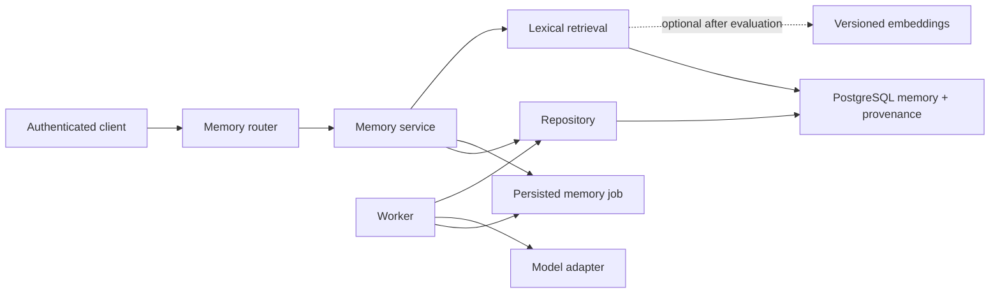

# Phase 8 handbook — Persistent memory and measured retrieval

This phase adds durable, user-controlled memory to the modular FastAPI application built in Phases 0–7. It is intentionally not “save every chat and put it in a prompt.” You will build a small information system with ownership, provenance, review, retention, deletion, and retrieval tests.

## 1. Outcome, prerequisites, and non-goals

By the end, an authenticated user can explicitly save a fact, preference, project note, or conversation summary; browse and edit it; archive or delete it; search active memory; review proposed machine-inferred memories; and observe durable summary/reindex jobs. Normal chat retrieval returns only a bounded set of active, owner-scoped items with provenance.

Prerequisites:

- The Phase 1 layered flow: router -> service -> repository -> sync SQLAlchemy 2 `Session` -> PostgreSQL.
- Authentication and `current_user` from Phase 2.
- Conversation records and a model adapter from Phase 4.
- The Phase 5 durable-work contract: idempotency, attempts, leases, retry time, cancellation, timestamps, and sanitized errors.
- Alembic, Pydantic 2, pytest, and the common `{ "error": ... }` envelope.

Non-goals:

- No autonomous psychological profile, secret store, knowledge graph, or “remember everything” behavior.
- No vector database on day one. PostgreSQL lexical search is the baseline.
- No claim that an embedding makes a memory accurate.
- No silent use of proposed, rejected, archived, expired, or another user’s memories.

## 2. Concepts you must understand first

**Chat history** is the chronological conversation record. **Memory** is a selected, durable item intended for later retrieval. Keeping them separate lets a user delete a conversation without pretending all derived facts are still trustworthy.

**Explicit memory** is deliberately saved or edited by the user. It starts `active`. **Inferred memory** is generated from a conversation or other source. It starts `proposed`, is absent from normal retrieval, and becomes active only after an immutable accept decision.

**Provenance** answers “where did this come from?” A source may be a conversation message, note, task, or user entry. Provenance is part of a result, not hidden implementation metadata.

**Lexical retrieval** matches words and word forms. PostgreSQL represents searchable documents as `tsvector`, queries as `tsquery`, and can rank matches. It is predictable, cheap, and easy to debug. **Semantic retrieval** compares embeddings; it may match paraphrases but adds a provider, model version, dimensions, stale-index handling, and evaluation burden.

**Recall@k** asks, “Of the labeled relevant items, what fraction appeared in the first k results?” Precision@k asks, “Of the first k results, what fraction were labeled relevant?” A demo that “looks good” is not a retrieval evaluation.

## 3. Architecture and state



The API transaction creates a job and commits quickly. The worker later claims it with a lease. Never keep an HTTP request or database transaction open while calling a model.

Memory item state:

```text
explicit create ------------------------------> active
inferred create -> proposed -> active          (accepted decision)
                            -> rejected         (rejected decision)
active -> archived -> active                    (deliberate restore)
active/proposed/rejected/archived -> deleted    (physical privacy deletion)
```

A decision is append-only and binds `memory_item_id + item_version + content_hash`. Editing proposed content creates a new version; an old approval cannot authorize changed text. “Immutable” means application code never updates a decision row. It does not mean privacy law or user deletion must preserve personal text forever: a hard delete cascades decisions and sources, while a minimal deletion audit may retain only non-content operational fields if your policy requires it.

Memory job state follows Phase 5:

```text
queued -> running -> succeeded
                  -> failed_retryable -> queued (if policy/attempts allow)
                  -> failed_terminal
queued/running -> cancel_requested -> cancelled
running with expired lease -> queued (if attempts remain)
```

At-least-once workers may repeat work. The job’s idempotency key and unique derived-item identity must make a repeated summary safe.

## 4. Dependencies and folders

Do not install a vector package yet. PostgreSQL full-text search is already available.

```text
app/
├── modules/memories/
│   ├── models.py                    # SQLAlchemy tables and invariants
│   ├── schemas.py                   # Pydantic request/response contracts
│   ├── repository.py                # Owner-scoped SQL and row staging
│   ├── service.py                   # State, provenance, transaction decisions
│   ├── retrieval.py                 # Ranking interface and lexical implementation
│   ├── jobs.py                      # Claim and execute summary/reindex work
│   ├── dependencies.py              # request-scoped service construction
│   └── router.py                    # HTTP-only contracts under /api/v1
├── workers/main.py                  # consolidated loop/dispatch introduced below
└── core/llm/                        # Phase 4 LLMClient/LLMRequest; summaries adapt to this port
tests/
├── unit/memories/                   # Pure policy/ranking tests
├── integration/memories/            # Real PostgreSQL constraints and queries
└── contract/test_memories_api.py    # HTTP contract and error envelope
```

This preserves the foundation's feature-first `app/modules/<feature>` convention. Do not make a second application or a `utils.py` dumping ground. Routers do not query SQLAlchemy; repositories do not commit; the service owns `commit()`/`rollback()`.

## 5. Data model and first migration

Use UUID primary keys and timezone-aware timestamps. Candidate columns and invariants:

### `memory_items`

- `id`, `user_id` (FK), `kind` (`fact|preference|project_note|conversation_summary`).
- `content` with a practical size check; `content_hash` SHA-256 over normalized content.
- `status` (`proposed|active|rejected|archived`).
- `origin` (`explicit|inferred`), `confidence` nullable, `importance` small integer.
- `version >= 1`; `valid_from TIMESTAMPTZ NOT NULL` defaults to creation/database time, `valid_until` is nullable and must be later than `valid_from`; `archived_at` and timestamps.
- `created_by_job_id` nullable; a unique partial identity such as `(created_by_job_id, content_hash)` prevents replayed extraction from duplicating an item.
- The v1 explicit-create duplicate policy is strict per owner: a partial unique constraint on `(user_id, kind, content_hash)` for `status IN ('active','proposed')` rejects another live exact normalized item. Archived/rejected rows do not block a deliberate new memory. Catch only this named constraint and return the existing safe item ID; concurrent identical creates converge. A later “merge similar memories” feature requires a new reviewed contract—it is not fuzzy matching in this transaction.
- Owner/status/time indexes and a GIN lexical-search expression index.

### `memory_sources`

- `id`, `memory_item_id` with `ON DELETE CASCADE`.
- `source_type` is a closed enum (`conversation|message|note|task`). There is deliberately no `user_entry` arm because no such resource exists: a manual entry is represented truthfully by `memory_items.origin='explicit'` and may have zero sources.
- A live source has a UUID `source_id` owned by the same user, optional stable `source_version`/content hash, safe excerpt, and `source_deleted_at NULL`. A privacy tombstone has `source_deleted_at NOT NULL` and requires `source_id`, version, hash, and excerpt all null. Add a database check enforcing exactly one of these shapes.
- A client source request is exactly `{source_type,source_id,source_version?,source_content_hash?,excerpt?}`. `source_type` is non-null `conversation|message|note|task`; `source_id` is a non-null UUID. Version/hash/excerpt may be omitted or null; when non-null, version is stripped 1–100 characters, content hash is exactly 64 lowercase hex, and excerpt is stripped 1–500. Clients cannot submit `source_deleted_at` or a tombstone. Unknown fields, blank optionals, invented `user_entry`, and null required fields are forbidden. A create request accepts 0–20 distinct source objects.
- The service resolves each source through its owner-scoped repository before insertion. The API does not accept a source user ID, and a foreign/missing source returns `404 MEMORY_SOURCE_NOT_FOUND`. Conversation summaries require at least one conversation/message source; explicit user entries may have zero sources.
- The only provenance-identity uniqueness is a **partial unique index on live rows** covering `(memory_item_id,source_type,source_id,source_version)` with nulls treated as equal. Tombstones are excluded by `WHERE source_deleted_at IS NULL`, so multiple erased sources of the same type remain as distinct rows identified by their UUID primary keys. Never retain the earlier table-wide `UNIQUE ... NULLS NOT DISTINCT`: once source ID/version are nulled it would collapse every same-type tombstone into one key and make privacy deletion fail.

### `memory_decisions`

- `id`, `memory_item_id`, `decided_by_user_id`, `decision` (`accepted|rejected`).
- `item_version`, `content_hash`, optional reason, `created_at`.
- Unique `(memory_item_id, item_version)` means one decision for a version.
- Deny `UPDATE` in repository/service code; a database trigger is optional defense in depth.

### `memory_jobs`

- Domain: `job_type` (`summarize_conversation|reindex_item`), `target_type`, `target_id`.
- Immutable input: `input_schema_version`, canonical input JSONB, canonical input hash, and an ordered snapshot of source message IDs, sequences, roles, content hashes, and retained content (or immutable content-snapshot IDs). The worker builds its `LLMRequest` only from this snapshot, never from a later live conversation query.
- Durable contract: status, idempotency key, attempt/max attempts, next attempt, lease owner/expiry, heartbeat, cancellation request, started/finished, sanitized error code/message.
- Unique `(user_id, idempotency_key)`.

### `memory_job_messages`

- `job_id` FK with cascade plus `position` and unique `(job_id, position)` preserve order.
- Nullable original `message_id` (`ON DELETE SET NULL`), original sequence/role, required content hash, and the exact bounded content snapshot encrypted under the workspace data key. The worker reads this row, not the mutable conversation table.
- The job's canonical input lists each position/message ID/hash and `input_schema_version`; its stored `input_hash` binds the whole ordered snapshot and request options. A reused key compares this hash before returning the prior job.
- User deletion cancels unfinished work and deletes both snapshots and resulting proposals according to the documented privacy policy; job metadata may retain only safe tombstone hashes/status.

### `memory_job_attempts` and deletion fencing

- Each actual summary-model dispatch inserts an attempt row before the external call: job ID, attempt number, claimed `lease_generation`, state `dispatching|succeeded|failed_retryable|failed_terminal|outcome_unknown|cancelled`, safe provider request ID/usage/cost/error, and timestamps. Unique `(job_id,attempt_number)`; prompts and model output never live here.
- `memory_jobs.lease_generation` is a nonnegative integer incremented whenever a claim is invalidated; `input_revoked_at` is nullable. Canonical input JSON/hash/key fields must be nullable only when `input_revoked_at` is non-null, with a check requiring the live-input or erased-tombstone shape.
- A worker creates the `dispatching` attempt and commits before the call. Proposal insertion/finalization is one fresh transaction guarded by job ID, claimed generation, `status='running'`, and `input_revoked_at IS NULL`. A zero-row guarded update means discard output and insert no memory.
- Conversation deletion marks any currently dispatching attempt `outcome_unknown`, conservatively retains/reconciles possible cost, and terminally cancels its job. The provider call may already have received content and cannot be recalled, but its late result cannot recreate a snapshot, proposal, or conversation.

### Cross-phase conversation foreign keys

Before extending conversation deletion, inspect the migrated Phase 5 constraint: `tool_runs.conversation_id` must be nullable and `REFERENCES conversations(id) ON DELETE SET NULL`. Tool execution/audit rows survive deletion but lose the conversation link; their own retention/deletion policy still applies. If the existing constraint differs, the Phase 8 Alembic migration drops that **exact resolved constraint name** and recreates it as `ON DELETE SET NULL`—never guess a production constraint name. Keep Phase 4 `messages`/`model_calls` cascades. Add a PostgreSQL migration test that deletes a conversation and proves messages/model calls disappear while the tool run remains with a null conversation ID.

### First Alembic migration

Create enums as check constraints initially; Python enums plus database checks prevent invalid states from non-API writers. A representative lexical index is:

```sql
CREATE INDEX ix_memory_items_lexical_active
ON memory_items
USING gin (to_tsvector('english', coalesce(content, '')))
WHERE status = 'active';
```

Create the source shape check and live-only identity explicitly. If an earlier draft migration/database already created `uq_memory_sources_identity`, remove the resolved constraint/index before adding the replacement; use the actual Alembic/inspector-resolved name in a real upgrade rather than assuming third-party naming conventions:

```sql
ALTER TABLE memory_sources
DROP CONSTRAINT IF EXISTS uq_memory_sources_identity;

DROP INDEX IF EXISTS uq_memory_sources_identity;

ALTER TABLE memory_sources
ADD CONSTRAINT ck_memory_sources_live_or_tombstone CHECK (
  (
    source_deleted_at IS NULL
    AND source_id IS NOT NULL
  )
  OR
  (
    source_deleted_at IS NOT NULL
    AND source_id IS NULL
    AND source_version IS NULL
    AND source_content_hash IS NULL
    AND excerpt IS NULL
  )
);

CREATE UNIQUE INDEX uq_memory_sources_live_identity
ON memory_sources (
  memory_item_id,
  source_type,
  source_id,
  source_version
)
NULLS NOT DISTINCT
WHERE source_deleted_at IS NULL;
```

PostgreSQL places `NULLS NOT DISTINCT` after the indexed column list and before `WHERE`. Alembic may require `op.execute()` for this exact partial-index syntax; inspect emitted SQL. A downgrade must drop `uq_memory_sources_live_identity` before removing `source_deleted_at`, and may recreate the old live schema only in a disposable downgrade path after proving no tombstones exist—never make privacy tombstones non-upgradable by surprise.

Choose and document the language configuration. `english` stemming can be wrong for names or multilingual text; `simple` may be a better first baseline. Add `ORDER BY rank DESC, updated_at DESC, id DESC` so pagination is stable.

Migration verification:

1. Upgrade a blank test database to `head`.
2. Inspect constraints with `\d+ memory_items` in `psql`.
3. Insert an invalid status using SQL and see PostgreSQL reject it.
4. Downgrade/upgrade only in disposable test data.
5. Run `alembic check`, then review generated SQL. Autogeneration is a draft, not schema design.
6. Inspect `pg_indexes.indexdef` and prove `uq_memory_sources_live_identity` contains both `NULLS NOT DISTINCT` and `WHERE (source_deleted_at IS NULL)`; prove the old broad constraint/index is absent.

## 6. API conventions for this phase

All routes are under `/api/v1`, require bearer authentication, and expose only the caller’s rows. UUIDs belonging to another user return the same `404 MEMORY_NOT_FOUND` as absent UUIDs to reduce enumeration. Validation uses the project’s stable `REQUEST_VALIDATION_FAILED`; unexpected errors are sanitized. Every request-body model uses `extra="forbid"`: unknown fields return `422`. Unless a worksheet explicitly marks a field optional/nullable, it is required and cannot be null. Unless listed, an endpoint has no query parameters; GET/DELETE endpoints have no request body. Unless listed, a response has no special header beyond the normal content type and project request ID. These defaults are part of every worksheet below.

In the worksheets, bare `401` means `401 INVALID_ACCESS_TOKEN`, bare `422` means `422 REQUEST_VALIDATION_FAILED`, and the named not-found code in that endpoint is used for both absent and foreign-owner resources. All use the foundation's exact error-envelope DTO and request ID.

List responses use cursor pagination. Writes return a strong quoted `ETag` with wire form `"mem-v<positive-version>-<64-lowercase-hex-content-hash>"`. Required `If-Match` accepts exactly one strong value in that form; weak tags, `*`, lists, whitespace/control characters, and multiple headers are rejected. Missing returns `428 PRECONDITION_REQUIRED`, malformed returns `422 REQUEST_VALIDATION_FAILED`, and a well-formed stale tag returns `412 PRECONDITION_FAILED`. Do not accept a user ID in bodies.

Every required `Idempotency-Key` header in this and later phases is a non-null ASCII string of 1–128 characters matching `^[A-Za-z0-9][A-Za-z0-9._:-]{0,127}$`; whitespace, commas, Unicode, control characters, and multiple header values are invalid. Missing returns `400 IDEMPOTENCY_KEY_REQUIRED`; malformed returns `422 REQUEST_VALIDATION_FAILED`. The key is scoped to authenticated user plus operation. A replay with the same canonical input returns the originally stored status/body/headers; reuse with different canonical input returns `409 JOB_IDEMPOTENCY_CONFLICT`. Test 0/1/128/129 characters, bad alphabet, duplicate headers, same-input replay, changed-input conflict, and same key for two users/operations.

The public DTOs below are normative. All objects reject/omit no undocumented fields; all timestamps are offset-aware RFC 3339 strings normalized to UTC; all UUIDs use canonical hyphenated strings. “Nullable” means the JSON key is always present with a value or `null`—not silently omitted.

- `MemorySourceDTO` has exactly: `id: UUID`; `source_type: "conversation"|"message"|"note"|"task"`; `source_id: UUID|null`; `source_version: string|null` (1–100 when non-null); `source_content_hash: string|null` (64 lowercase hexadecimal when non-null); `excerpt: string|null` (stripped 1–500 when non-null); `source_deleted_at: timestamp|null`; and `created_at: timestamp`. A live DTO requires non-null source ID and null deletion time; a privacy tombstone requires non-null deletion time and null ID/version/hash/excerpt.
- `MemoryDTO` has exactly: `id: UUID`; `kind: "fact"|"preference"|"project_note"|"conversation_summary"`; `content: string` (1–20,000); `status: "proposed"|"active"|"rejected"|"archived"`; `origin: "explicit"|"inferred"`; `importance: integer` (1–5); `confidence: number|null` (0–1 when non-null; explicit memory normally uses null); `version: integer >=1`; `content_hash: 64-lowercase-hex string`; `valid_from: timestamp`; `valid_until: timestamp|null`; `archived_at: timestamp|null`; `created_at: timestamp`; and `updated_at: timestamp`. Validity/archival state invariants remain server enforced.
- `MemoryDecisionDTO` has exactly: `id: UUID`; `memory_item_id: UUID`; `decision: "accepted"|"rejected"`; `item_version: integer >=1`; `content_hash: 64-lowercase-hex string`; `reason: string|null` (stripped 1–500 when non-null); and `created_at: timestamp`.
- `MemoryDetailDTO` has every `MemoryDTO` field plus `sources: array[MemorySourceDTO]` (0–20, stable `created_at ASC,id ASC`) and `decision: MemoryDecisionDTO|null` for the current version.
- `MemoryListDTO` has exactly `items: array[MemoryDTO]` (0–requested `limit`) and `next_cursor: string|null` (opaque base64url, 1–2,048 when non-null). Empty pages use `items: []` and `next_cursor: null`.
- `SafeJobErrorDTO` has exactly `code: string` (1–64, `^[A-Z][A-Z0-9_]*$`) and `message: string` (1–500); it never contains exception/provider bodies.
- `MemoryJobDTO` has exactly: `id: UUID`; `job_type: "summarize_conversation"|"reindex_item"`; `target_type: "conversation"|"memory"`; `target_id: UUID`; `status: "queued"|"running"|"failed_retryable"|"succeeded"|"failed_terminal"|"cancel_requested"|"cancelled"`; `attempt: integer` (0–10); `max_attempts: integer` (1–10 and not below `attempt`); `proposal_ids: array[UUID]` (0–20); `error: SafeJobErrorDTO|null`; `created_at: timestamp`; `started_at: timestamp|null`; and `finished_at: timestamp|null`. `error` is non-null only in failed states; terminal states have `finished_at`.
- `MemorySearchHitDTO` has exactly `memory: MemoryDTO`; `score: number` (finite 0–1, rounded to at most six decimal places by the versioned ranking normalizer); `matched_by: "lexical"|"semantic"|"both"`; and `sources: array[MemorySourceDTO]` (0–20). Score is for ordering/debugging within the named strategy, not a probability or a stable cross-version value.
- `MemorySearchDTO` has exactly `query: string` (the normalized 1–1,000-character query); `strategy: "lexical"|"semantic"|"hybrid"`; `valid_at: timestamp`; `ranking_version: string` (1–64); and `results: array[MemorySearchHitDTO]` (0–requested limit). Stable ties use score, `updated_at`, then ID; no SQL rank/cursor internals are exposed.

### Endpoint worksheet 1 — create explicit memory

- **Purpose:** Save one user-authored item as active memory.
- **Method/path/auth:** `POST /api/v1/memories`; authenticated owner.
- **Body:** Exactly `{kind,content,importance?,valid_until?,sources?}`. Kind is a non-null memory-kind enum; content is non-null stripped 1–20,000; importance is non-null integer default 3, range 1–5; valid-until may be omitted/null or an aware future RFC 3339 timestamp; sources is non-null array default `[]`, length 0–20, using only `conversation|message|note|task`. Manual entry is the default empty-source case—never manufacture a `user_entry` source. Unknown/null required fields fail `422`. `origin='explicit'`, status, and valid-from are server-owned.
- **Success:** `201 MemoryDTO`; headers `Location: /api/v1/memories/{id}` and a quoted strong `ETag`.
- **Errors:** `400 MEMORY_SENSITIVE_CONTENT_REJECTED` for prohibited secret categories; `404 MEMORY_SOURCE_NOT_FOUND`; `409 MEMORY_DUPLICATE` with the existing safe ID under the strict v1 exact-live-duplicate policy; `422 REQUEST_VALIDATION_FAILED`; `401 INVALID_ACCESS_TOKEN`.
- **Tables/transaction:** Owner-resolve every supplied source, then insert item and sources in one service transaction; commit once, refresh once.
- **Side effects:** None outside PostgreSQL.
- **Tests:** Each kind; whitespace/length; sequential/concurrent duplicate hash; archived/rejected and cross-owner duplicate rules; zero-source manual entry returns `origin=explicit`; 20/21 sources; each of four types; `user_entry` rejected; client tombstones/deletion-time rejected; live/tombstone DB check; duplicate identity; missing/foreign source; provenance atomicity; ownership; headers; rollback on source-insert failure.

### Endpoint worksheet 2 — list memories

- **Purpose:** Browse owner-scoped memory without invoking a model.
- **Method/path/auth:** `GET /api/v1/memories`; authenticated.
- **Params:** Repeated `kinds` values, each one of `fact|preference|project_note|conversation_summary`, optional, unique, at most four; `status` is one of `proposed|active|rejected|archived` and defaults to `active`; `valid_at` is an optional non-null offset-aware RFC 3339 timestamp and defaults to the injected service clock; `limit` is an integer default 20, range 1–100; `cursor` is optional non-null opaque base64url text, 1–2,048 characters, bound to all filters. Unknown query parameters follow the API's documented rejection policy.
- **Success:** `200 MemoryListDTO`; an empty page is exactly `{"items":[],"next_cursor":null}`.
- **Errors:** `400 INVALID_CURSOR`; `422 REQUEST_VALIDATION_FAILED`; `401`.
- **Tables/transaction:** Read `memory_items`, optionally source counts; read-only transaction.
- **Side effects:** None.
- **Tests:** Every kind/status, repeated/duplicate/unknown kinds, default active/current-time behavior, naive/null `valid_at`, 0/1/20/100/101 limits, stable tie ordering, validity boundaries, no cross-user rows, and cursor tampering/filter mismatch.

### Endpoint worksheet 3 — retrieve one memory

- **Purpose:** Show content, state, provenance, and version.
- **Method/path/auth:** `GET /api/v1/memories/{memory_id}`; authenticated owner.
- **Body/params:** None beyond UUID path.
- **Success:** `200 MemoryDetailDTO` and a quoted strong `ETag`.
- **Errors:** `404 MEMORY_NOT_FOUND`; `422 REQUEST_VALIDATION_FAILED` for malformed UUID; `401`.
- **Tables/transaction:** Item plus ordered sources and decision summary; read-only.
- **Side effects:** None; do not update “last accessed” synchronously.
- **Tests:** Active/proposed visibility to owner, foreign-owner indistinguishability, provenance order, ETag stability.

### Endpoint worksheet 4 — patch a memory

- **Purpose:** Partially edit content/importance/validity or deliberately archive/restore.
- **Method/path/auth:** `PATCH /api/v1/memories/{memory_id}`; owner; `If-Match` required.
- **Body:** Any subset of `{content, importance, valid_from, valid_until, status}`; content is non-null 1–20,000, importance non-null 1–5, validity timestamps are aware (`valid_until` alone is nullable to clear expiry) and must satisfy `valid_from < valid_until` when both exist. Client status transitions are only `active -> archived` and `archived -> active`; proposed/rejected status changes happen only through decisions and cannot be supplied. Reject empty/unknown input and explicit null elsewhere.
- **Success:** `200 MemoryDTO` and the new quoted strong `ETag`.
- **Errors:** `404 MEMORY_NOT_FOUND`; `409 MEMORY_VERSION_CONFLICT`; `409 MEMORY_ALREADY_DECIDED` when trying to mutate a decided proposal; `409 INVALID_MEMORY_TRANSITION`; `428 PRECONDITION_REQUIRED`; `412 PRECONDITION_FAILED`; `422`.
- **Tables/transaction:** Lock item; update and increment version. If content changes, invalidate/delete its embedding in the same transaction. A proposal edit creates a new undecided version.
- **Side effects:** Optionally enqueue a unique reindex job after the row change in the same commit.
- **Tests:** Omitted-vs-null, stale ETag, hash/version update, embedding invalidation, rollback, illegal transition.

### Endpoint worksheet 5 — hard-delete a memory

- **Purpose:** Honor user deletion across primary and derived stores.
- **Method/path/auth:** `DELETE /api/v1/memories/{memory_id}`; owner; required `If-Match` so deletion cannot race unnoticed with a newer version.
- **Body:** None.
- **Success:** `204` with no body.
- **Errors:** `404 MEMORY_NOT_FOUND`; `409 MEMORY_JOB_RUNNING` if safe cancellation/cleanup cannot yet be guaranteed; missing/stale ETag `428 PRECONDITION_REQUIRED`/`412 PRECONDITION_FAILED`; `401`.
- **Tables/transaction:** Delete item; FK cascades sources, decisions, embeddings; cancel queued reindex work. Commit atomically.
- **Side effects:** Evict caches/object artifacts via a durable cleanup record if present, not an in-memory callback.
- **Tests:** Cascades, search exclusion, vector exclusion, idempotent client behavior on repeated `404`, other-user denial, cleanup retry.

### Endpoint worksheet 6 — decide a proposed memory

- **Purpose:** Accept or reject one exact inferred version.
- **Method/path/auth:** `POST /api/v1/memories/{memory_id}/decisions`; owner.
- **Body:** Exactly `{decision,item_version,content_hash,reason?}`: decision is `"accepted"|"rejected"`; item version is a non-null integer >=1; hash is non-null 64 lowercase hex; reason may be omitted or null, and when non-null is stripped 1–500 characters. Empty/whitespace/501-character reasons, unknown fields, and null required fields return `422`.
- **Success:** `201 MemoryDecisionDTO`; no `Location` until a retrieve-decision endpoint actually exists.
- **Errors:** `404 MEMORY_NOT_FOUND`; `409 MEMORY_NOT_PROPOSED`; `409 MEMORY_VERSION_CONFLICT`; `409 MEMORY_DECISION_EXISTS`; `422`.
- **Tables/transaction:** `SELECT ... FOR UPDATE`; verify proposed state and exact hash/version; insert decision; transition to active/rejected; commit once.
- **Side effects:** Accepted items become eligible for lexical retrieval only after commit; insert a unique reindex job in that same transaction when the optional embedding implementation is enabled.
- **Tests:** Accept/reject; reason omitted/null/1/500/501/whitespace; hash/version bounds; unknown/null required fields; replay; changed content; concurrent decisions (one wins); response DTO exactness; no repository commit; decision update impossible.

### Endpoint worksheet 7 — search memory

- **Purpose:** Perform a complex, bounded read and return ranked results with provenance.
- **Method/path/auth:** `POST /api/v1/memory-searches`; authenticated.
- **Body:** Exactly `{query, kinds?, limit?, valid_at?, strategy?}`. `query` is required, non-null, stripped 1–1,000 characters; `kinds` is optional, non-null, unique, 1–4 values from the four memory kinds; `limit` is an integer default 8, range 1–20; `valid_at` is optional, non-null, offset-aware RFC 3339 and defaults to the injected service clock; `strategy` is `lexical|semantic|hybrid`, defaults to `lexical`, and semantic/hybrid are accepted only when the versioned embedding implementation is enabled. Unknown fields and explicit nulls are rejected.
- **Success:** `200 MemorySearchDTO`; every hit uses the bounded normalized score, closed `matched_by` enum, complete `MemoryDTO`, and bounded source DTOs defined above.
- **Errors:** `400 MEMORY_SEARCH_QUERY_EMPTY`; `400 MEMORY_SEARCH_STRATEGY_UNAVAILABLE`; `422`; `401`.
- **Tables/transaction:** Query active, currently valid owner rows and sources. No writes.
- **Side effects:** Emit aggregate latency/result-count telemetry without query text or user ID as metric labels.
- **Tests:** Query 0/1/1,000/1,001 characters and whitespace; every kind and duplicate/empty/unknown kinds; limits 0/1/8/20/21; naive/null/current-time `valid_at`; each strategy and unavailable strategy; ranking, stable ties, proposed/rejected/not-yet-valid/expired exclusion, owner boundary, punctuation, stop words, result cap, and representative indexed query plan.

### Endpoint worksheet 8 — create conversation summary job

- **Purpose:** Queue inferred summary extraction from an owned conversation.
- **Method/path/auth:** `POST /api/v1/conversations/{conversation_id}/summary-jobs`; owner; exactly one `Idempotency-Key` satisfying the common 1–128-character policy is required.
- **Body:** `{message_through_id?, max_proposals=5}`; optional message ID is non-null UUID when present and max proposals is 1–20. In the creation transaction the service locks/owner-checks the conversation and copies its ordered message IDs, sequence/role, content hashes, and content (or immutable snapshot IDs) through that boundary into canonical job input; later conversation edits cannot change the job.
- **Success:** `202 MemoryJobDTO`; `Location: /api/v1/memory-jobs/{id}` and integer `Retry-After: 2`. An idempotent replay returns the stored DTO and these headers.
- **Errors:** `404 CONVERSATION_NOT_FOUND`; `409 JOB_IDEMPOTENCY_CONFLICT` if the key was reused for different input; `409 CONVERSATION_EMPTY`; `422`.
- **Tables/transaction:** Read/lock the owned `conversations`/`messages`; insert `memory_jobs` plus ordered `memory_job_messages`; canonicalize/hash the complete input; commit atomically. The idempotency fingerprint is this canonical input hash, not merely the conversation ID.
- **Side effects:** Worker later calls a fake/real model; API does not.
- **Tests:** Same key/same snapshot returns the same job; same body after the source range changes conflicts; changed body conflicts; exact order/IDs/hashes/content survive later conversation edits; deletion policy erases snapshots/cancels work; no model call in request; ownership.

### Endpoint worksheet 9 — get memory job

- **Purpose:** Poll durable progress and safe outcome.
- **Method/path/auth:** `GET /api/v1/memory-jobs/{job_id}`; owner.
- **Body/params:** None.
- **Success:** `200 MemoryJobDTO`; add integer `Retry-After: 2` only for `queued|running|failed_retryable|cancel_requested`, and omit it for every terminal state.
- **Errors:** `404 MEMORY_JOB_NOT_FOUND`; `401`; malformed UUID `422`.
- **Tables/transaction:** Read job and safe result links.
- **Side effects:** None.
- **Tests:** Every state, redacted exception/provider payload, cross-user `404`, terminal response omits retry hint.

### Endpoint worksheet 10 — cancel memory job

- **Purpose:** Stop queued work or request cooperative cancellation.
- **Method/path/auth:** `POST /api/v1/memory-jobs/{job_id}/cancel`; owner.
- **Body:** The body may be omitted or be exactly `{}` / `{"reason":"..."}`. `reason`, when present, is non-null, stripped 1–500 characters; empty/whitespace, explicit null, more than 500 characters, arrays/scalars, and every unknown field are rejected by `ConfigDict(extra="forbid")` with `422 REQUEST_VALIDATION_FAILED`.
- **Success:** `202 MemoryJobDTO` when running becomes `cancel_requested`; `200 MemoryJobDTO` when queued becomes `cancelled` immediately. The response always obeys the DTO state/timestamp/error invariants.
- **Errors:** `404 MEMORY_JOB_NOT_FOUND`; `409 MEMORY_JOB_TERMINAL`; `401`.
- **Tables/transaction:** Lock job; set terminal cancelled or `cancel_requested_at`; commit.
- **Side effects:** Worker observes flag between bounded steps. It does not interrupt a database commit halfway.
- **Tests:** Omitted/empty/reason body, 1/500/501 characters, whitespace/null/unknown/scalar bodies, queued/running/terminal behavior, repeated request, race with completion, and worker stops before the next model/reindex step.

### Endpoint worksheet 11 — extend Phase 4 conversation deletion

- **Purpose:** Erase an owned conversation and its memory-derived input without letting a stale summary worker recreate data.
- **Method/path/auth:** `DELETE /api/v1/conversations/{conversation_id}`; bearer-authenticated owner; this replaces the Phase 4 worksheet's narrower transaction after the Phase 8 migration is installed.
- **Path/query/body:** Canonical UUID path. Optional non-null scalar `derived_memory` is `delete|preserve_accepted` and defaults to `delete`; supplying `preserve_accepted` is the only affirmative preservation choice. Repeated/null/unknown query parameters return `422 REQUEST_VALIDATION_FAILED`. No request body; a nonempty body returns `400 REQUEST_BODY_NOT_ALLOWED`.
- **Success/status/headers:** `204 No Content`, exactly empty body and standard request-ID header. No asynchronous cleanup is implied: the local transaction below has committed before success.
- **Errors:** `401 INVALID_ACCESS_TOKEN`; owner-hidden `404 CONVERSATION_NOT_FOUND`; malformed UUID/query `422 REQUEST_VALIDATION_FAILED`; `409 CONVERSATION_BUSY` only for Phase 4 chat model-call work whose existing policy requires retry. Summary jobs are cancelled rather than producing `409`.
- **Tables/transaction:** In one service-owned transaction: lock the owned conversation; apply the Phase 4 busy check before any mutation; snapshot its message IDs; lock affected `memory_jobs`, `memory_job_attempts`, inferred items/decisions/sources in deterministic ID order; then perform all rules below and delete the conversation. Repositories flush but do not commit.
- **Job/snapshot rule:** For every conversation summary job targeting this conversation, increment `lease_generation`, set `input_revoked_at`, null its canonical input JSON/hash and idempotency key, and delete every encrypted `memory_job_messages` row. Transition `queued|running|failed_retryable|cancel_requested` to `cancelled`, set internal `cancellation_reason_code='SUMMARY_SOURCE_DELETED'`, finished/cancellation timestamps, and clear lease fields. This is not a failed-state `error` in `MemoryJobDTO`. Preserve only non-content job identity/timing/counter metadata. Mark a `dispatching` attempt `outcome_unknown`; already terminal attempt rows keep only permitted safe telemetry.
- **Memory rule:** Always hard-delete proposed/rejected inferred items produced by affected jobs. With default `derived_memory=delete`, also hard-delete every affected inferred active/archived item. With explicit `preserve_accepted`, preserve only inferred active/archived items having an immutable `accepted` decision for their current version; turn each deleted conversation/message provenance row into the checked privacy-tombstone shape and retain the decision/content. Explicit-origin memories are not derived and remain, but any source pointing to the deleted conversation/message is likewise tombstoned. Delete embeddings/cache-cleanup records for every deleted item in the same transaction/durable cleanup contract.
- **Conversation/FK rule:** Delete `conversations`; Phase 4 cascades messages/model calls. Phase 5 tool runs survive with `conversation_id=NULL` through the required `ON DELETE SET NULL` FK. No dangling live memory source may retain a deleted conversation/message UUID, hash, excerpt, or version.
- **Worker race:** Finalization inserts proposals only while its job update matches the claimed generation, `running` status, and non-revoked input. If worker finalization commits first, deletion locks next and deletes/preserves its item under the selected rule; if deletion commits first, finalization affects zero rows and discards output. Never wait for or kill an in-flight provider request while holding locks.
- **External side effects/privacy:** Content already sent to a model provider cannot be recalled; a started call may finish and may incur unknown cost. Record this only as safe outcome/cost telemetry, never model output. Local encrypted snapshots and canonical content are gone at `204`; backup expiry follows the documented retention window.
- **Tests:** Default vs explicit preservation; query omitted/delete/preserve/null/repeated/unknown; nonempty body; absent/foreign/malformed; Phase 4 busy rollback leaves every memory/job row unchanged; queued/running/retry/cancel-requested and terminal jobs; encrypted snapshot/canonical input/idempotency erasure; dispatch-before-delete and delete-before-finalize barriers prove no late proposal; dispatch attempt becomes outcome-unknown with conservative cost; proposed/rejected deletion; accepted active/archived default deletion and explicit preservation; current-version decision requirement; explicit memory retained with tombstoned provenance; no deleted UUID/hash/excerpt/version remains in sources; lexical/vector exclusion; messages/model calls cascade; tool run survives with null FK; exact empty `204`; repeated delete `404`.

## 7. Build vertical slices

Build in this order, keeping each slice shippable:

1. Item/source/decision migrations, live-versus-tombstone source checks, memory-job attempt/fence fields, and the verified Phase 5 `tool_runs.conversation_id ON DELETE SET NULL` migration test.
2. Create + retrieve explicit memory.
3. List + patch + delete, including ETags.
4. Lexical search and a ten-query labeled evaluation fixture.
5. Decision endpoint and manually seeded proposals.
6. Add `app/workers/main.py` as the one worker composition root. It builds a registry from a closed job-kind string to reviewed claim/execute functions for every queue that already exists: Phase 5 tool runs; Phase 6 external actions and credential revocations; Phase 7 notification deliveries, Slack revocations, webhook commands, voice transcription/interpretation, and audio deletion. Then add Phase 8 memory summary/reindex handlers. It runs each eligible claimer for a bounded batch and owns stop signals, polling/backoff, Session/client startup, and cleanup. A database row never supplies an import path or command.
7. Change every Phase 5–7 development command from its feature-only loop to `python -m app.workers.main`; keep feature worker files as handler/executor modules, not competing endless processes. Register a handler only after its migration exists, and fail startup when an enabled durable operation has no registered code handler.
8. Persisted job creation/poll/cancel with a fake summarizer.
9. Worker claim/recovery, pre-dispatch attempt row, generation-fenced idempotent proposal insertion, and late-result discard tests.
10. Extend Phase 4 conversation `DELETE` with the exact job/snapshot erasure and `derived_memory` policy worksheet above; run both lock-order race directions before moving on.
11. Optional embedding experiment only if the lexical baseline misses labeled paraphrases.

Test the consolidated entry point with injected one-iteration/poll controls: every Phase 5–8 handler receives eligible work; an unknown persisted kind cannot execute code; one failing handler does not starve the others; SIGTERM stops new claims and closes resources; and startup detects an enabled-but-unregistered operation. Every later phase registers handlers at this same composition root; it does not create another worker process unless isolation or scaling evidence justifies one.

## 8. Selective reference snippets

Pydantic makes client intent explicit. The service still enforces state and ownership.

```python
from enum import StrEnum
from typing import Annotated

from pydantic import BaseModel, ConfigDict, Field, StringConstraints


class MemoryKind(StrEnum):
    FACT = "fact"
    PREFERENCE = "preference"
    PROJECT_NOTE = "project_note"
    CONVERSATION_SUMMARY = "conversation_summary"


MemoryText = Annotated[str, StringConstraints(strip_whitespace=True, min_length=1, max_length=20_000)]


class StrictRequest(BaseModel):
    model_config = ConfigDict(extra="forbid")


class MemoryCreate(StrictRequest):
    kind: MemoryKind
    content: MemoryText
    importance: int = Field(default=3, ge=1, le=5)


class MemoryDecisionCreate(StrictRequest):
    decision: Annotated[str, StringConstraints(pattern=r"^(accepted|rejected)$")]
    item_version: int = Field(ge=1)
    content_hash: Annotated[str, StringConstraints(pattern=r"^[0-9a-f]{64}$")]
    reason: Annotated[
        str, StringConstraints(strip_whitespace=True, min_length=1, max_length=500)
    ] | None = None
```

Normalize only rules you can defend. Unicode normalization plus collapsed whitespace gives repeatable hashes; it does not decide whether two differently worded facts mean the same thing.

```python
import hashlib
import re
import unicodedata


def normalized_memory_text(value: str) -> str:
    normalized = unicodedata.normalize("NFKC", value).strip()
    return re.sub(r"\s+", " ", normalized)


def memory_content_hash(value: str) -> str:
    return hashlib.sha256(normalized_memory_text(value).encode("utf-8")).hexdigest()
```

A PostgreSQL lexical query should always include owner/state/validity before ranking:

```python
from sqlalchemy import text
from sqlalchemy.orm import Session


LEXICAL_SQL = text("""
SELECT id,
       ts_rank_cd(
           to_tsvector('english', coalesce(content, '')),
           websearch_to_tsquery('english', :query)
       ) AS score
FROM memory_items
WHERE user_id = :user_id
  AND status = 'active'
  AND valid_from <= :valid_at
  AND (valid_until IS NULL OR valid_until > :valid_at)
  AND to_tsvector('english', coalesce(content, ''))
      @@ websearch_to_tsquery('english', :query)
ORDER BY score DESC, updated_at DESC, id DESC
LIMIT :limit
""")


def lexical_ids(session: Session, *, user_id: str, query: str, valid_at: object, limit: int) -> list[tuple[object, float]]:
    rows = session.execute(
        LEXICAL_SQL,
        {"user_id": user_id, "query": query, "valid_at": valid_at, "limit": limit},
    )
    return [(row.id, float(row.score)) for row in rows]
```

This function returns IDs and scores; the repository then loads owner-scoped models and provenance. Never interpolate query text into SQL.

The service transaction for a decision is the important boundary:

```python
def decide_memory(session, repository, *, user_id, memory_id, command):
    item = repository.get_for_update(session, user_id=user_id, memory_id=memory_id)
    if item is None:
        raise MemoryNotFound()
    if item.status != "proposed":
        raise MemoryNotProposed()
    if item.version != command.item_version or item.content_hash != command.content_hash:
        raise MemoryVersionConflict()

    repository.add_decision(session, item=item, user_id=user_id, command=command)
    item.status = "active" if command.decision == "accepted" else "rejected"
    try:
        session.commit()
    except Exception:
        session.rollback()
        raise
    session.refresh(item)
    return item
```

Keep domain exceptions narrow and translate them to stable HTTP codes in the shared boundary.

Summary extraction reuses the Phase 4 `app/core/llm/LLMClient` rather than defining another vendor-neutral model interface. A small `MemorySummarizer` application service converts the immutable memory-job snapshot into the existing `LLMRequest`, calls `LLMClient.generate()` outside a database transaction, validates the returned text/structured proposal format, and stores proposed items. Fake and real Phase 4 clients therefore exercise the same boundary; provider SDK types never enter the memory module.

## 9. Optional embeddings: a measured second implementation

Add the `vector` extension only after you have a labeled query set and a lexical baseline. A separate migration creates `memory_embeddings(memory_item_id, provider, model, model_version, dimensions, content_hash, embedding, indexed_at)`. Uniqueness covers item + embedding version; the row is stale whenever its content hash differs from the item.

Start with exact nearest-neighbor search. Approximate HNSW/IVFFlat indexes trade recall for speed and need measurement. Always filter by `user_id` through the joined memory item and exclude non-active rows. Never send sensitive memory to an embedding provider without disclosure and a retention/data-processing decision.

A hybrid experiment can normalize lexical and vector ranks and combine them, but save the scoring version in logs/evaluation output. Do not replace a measurable baseline with unexplained magic weights.

## 10. Testing strategy

### Unit tests

- Normalization/hash determinism, status transition matrix, decision hash binding.
- Retention/validity predicate at boundary timestamps: exclude just before `valid_from`, include exactly at `valid_from`, include just before `valid_until`, and exclude exactly at `valid_until`.
- Recall@k and precision@k functions using tiny labeled data.
- Worker outcome classification and retry/backoff without sleeping.

### PostgreSQL integration tests

- Check constraints and unique decisions under concurrent sessions.
- `ON DELETE CASCADE` removes sources/decisions/embeddings.
- Live source/tombstone shapes are mutually exclusive; client source types never include `user_entry`. Two concurrent inserts of the same live source with omitted version yield exactly one named-index conflict.
- Seed one accepted retained memory with two distinct live `message` sources from the same conversation, both with null versions; tombstone both in one transaction and assert commit succeeds, both UUID rows remain, all sensitive source columns are null, and the live partial index contains neither. This test fails if the old table-wide nulls-not-distinct uniqueness remains.
- Race two `derived_memory=preserve_accepted` conversation deletions with barriers: one commits `204`, the other observes the deleted owner resource as `404`; final state still has exactly the two distinct message tombstones and no uniqueness error or leaked live source identity.
- GIN lexical query excludes another owner and inactive/expired rows.
- Two workers using `FOR UPDATE SKIP LOCKED` do not claim one job simultaneously.
- Expired lease recovery increments attempts; max attempts ends failed.
- Deleting a conversation in the default/preserve modes erases snapshots/canonical input, applies exact inferred-memory rules, tombstones retained provenance, cascades chat rows, and sets the preserved Phase 5 tool-run link null.
- Two barrier-controlled transactions cover worker-finalizes-first and deletion-commits-first; neither leaves a post-delete proposal or content-bearing attempt/source/job row.

Use a real, separately named test database ending `_test`; guard fixtures from running against development/production. Clean tables in FK order or recreate a disposable database. Do not substitute SQLite for PostgreSQL text search or locking tests.

### Fake-provider tests

Define a `MemorySummarizer` protocol. The fake returns deterministic proposals, a timeout, malformed output, or a duplicate. Assert that model calls occur outside an open transaction, inferred items are proposed, retries do not duplicate rows, and raw provider errors are not returned.

### HTTP contract tests

For every endpoint assert method/path, exact status, response model, content type, error code, request ID, ownership, and documented headers. Check that `204` truly has an empty body and `202` has `Location`.

## 11. Try it with curl

```bash
curl -i -X POST http://127.0.0.1:8000/api/v1/memories \
  -H "Authorization: Bearer $ACCESS_TOKEN" \
  -H "Content-Type: application/json" \
  -d '{"kind":"preference","content":"Prefer concise API explanations","importance":4}'
```

```bash
curl -s -X POST http://127.0.0.1:8000/api/v1/memory-searches \
  -H "Authorization: Bearer $ACCESS_TOKEN" \
  -H "Content-Type: application/json" \
  -d '{"query":"API explanation style","limit":5,"strategy":"lexical"}'
```

Use an environment variable so the token is not pasted into shell history. Inspect `Location`, `ETag`, status, and error codes—not only the JSON happy path.

## 12. Debugging playbook

- **Item exists but search misses it:** inspect owner, status, validity, text-search configuration, and `websearch_to_tsquery` output in `psql`; then run `EXPLAIN (ANALYZE, BUFFERS)` on test-sized representative data.
- **Accepted text changed:** log item ID/version/hash and decision ID, not content. Verify row locking and stale-client handling.
- **Duplicate proposals after crash:** inspect idempotency key, job target snapshot, and unique derived-item constraint. A pre-check without a constraint races.
- **Job stuck running:** compare lease expiry/heartbeat to database time; check worker identity and transaction commits.
- **Deleted item still appears:** enumerate primary table, lexical query, embeddings, cache, and prompt assembly. Write a deletion integration test across all paths.
- **Deleted conversation recreated a proposal:** inspect the job's claimed/current lease generation, input-revoked timestamp, guarded finalization row count, transaction ordering, and source IDs. The worker must never insert first and check cancellation later.
- **Traceback:** read from the final exception upward until the first frame in your code. Record request ID/job ID; never expose the trace to the client.

## 13. Security, reliability, and privacy review

- Memory content and retrieved text are untrusted data. They cannot override system policy or grant tools.
- Apply auth in the query, not by fetching an arbitrary row then checking too late.
- Redact memory content from routine logs. Metrics must not use user IDs, queries, or memory IDs as unbounded labels.
- Reject or warn before storing passwords, API keys, recovery codes, payment data, or highly sensitive categories. Do not advertise perfect secret detection.
- Publish understandable retention defaults and let the user archive/delete/export.
- Derivation does not erase provenance. A summary should link its conversation/message hashes.
- Limit prompt context by count and total characters/tokens. Keep source IDs/hashes in the model-run record.
- A lease yields at-least-once execution, not exactly-once. Unique constraints and idempotent writes provide safety.
- Backups contain deleted data until their retention window expires; document that honestly and restrict backup access.

## 14. Exercises and checkpoint

Exercises:

1. Write the ten endpoint worksheets in your own words before copying any route decorator.
2. Create two contradictory preferences. Define a domain key or manual archive rule; explain why newest timestamp alone may be wrong.
3. Label ten queries against twenty memories. Calculate recall@3 and precision@3 by hand, then in a pure function.
4. Add a proposed memory, edit its text, and prove an approval for the old hash fails.
5. Crash the fake-summary worker after proposal insert but before job completion; retry without duplication.
6. Delete an accepted memory and prove it is absent from list, lexical, optional vector, cache, and assembled chat context.
7. Compare `simple` and `english` PostgreSQL configurations with names, code identifiers, and plurals.
8. Pause a fake model call at a barrier, delete its conversation under both `derived_memory` policies, release the call, and prove snapshots/output/proposals cannot return while a Phase 5 tool-run audit survives with a null conversation link.
9. If lexical recall is inadequate, add exact pgvector search behind the same retrieval protocol and compare the labeled scores before adding an approximate index.

Checkpoint:

- [ ] All migrations pass on a blank PostgreSQL test database.
- [ ] Explicit items start active; inferred items start proposed.
- [ ] One immutable decision is bound to an exact item version/hash.
- [ ] Only active, valid, owner-scoped items reach normal retrieval.
- [ ] Provenance is returned and recorded in model context metadata.
- [ ] Delete removes every search/index path.
- [ ] Summary/reindex work is persisted, leased, retryable, cancellable, and idempotent.
- [ ] Conversation deletion erases summary inputs, fences late workers, applies an explicit derived-memory policy, and preserves tool audit rows only through a null link.
- [ ] A labeled lexical baseline is recorded before vector work.

## 15. What you should be able to explain after this phase

Explain, without looking at code:

- Why conversation history and memory are different resources.
- Why inferred memory is proposed and why approval binds a content hash/version.
- Which layer owns authorization, state transitions, SQL, commit, and HTTP translation.
- How PostgreSQL `tsvector`, `tsquery`, GIN, ranking, and stable ordering fit together.
- The difference between lexical and semantic retrieval, exact and approximate vector search, and truth versus similarity.
- How provenance, retention, deletion, and backup retention affect user trust.
- Why conversation deletion increments a worker fence, how the two commit orders remain safe, and why an already-started provider call cannot be recalled.
- How a lease recovers work and why idempotency is still necessary.
- How recall@k and precision@k reveal whether retrieval improved.

## 16. Current primary documentation to read

Read with a question, reproduce one small example, and record the version/date consulted:

- [PostgreSQL full-text search controls and ranking](https://www.postgresql.org/docs/current/textsearch-controls.html)
- [PostgreSQL text-search data types](https://www.postgresql.org/docs/current/datatype-textsearch.html)
- [PostgreSQL constraints](https://www.postgresql.org/docs/current/ddl-constraints.html)
- [PostgreSQL `SELECT`, row locking, and `SKIP LOCKED`](https://www.postgresql.org/docs/current/sql-select.html)
- [pgvector official project documentation](https://github.com/pgvector/pgvector) — optional second implementation; pin an extension version.
- [SQLAlchemy Session basics](https://docs.sqlalchemy.org/en/20/orm/session_basics.html)
- [Alembic autogenerate](https://alembic.sqlalchemy.org/en/latest/autogenerate.html)
- [Pydantic models](https://docs.pydantic.dev/latest/concepts/models/)
- [FastAPI response headers](https://fastapi.tiangolo.com/advanced/response-headers/)

Provider behavior changes. When you add summaries or embeddings, also read the chosen provider’s current official model, structured-output, embedding, privacy/retention, pricing, usage, error, and rate-limit documentation; store exact provider/model/version metadata rather than copying assumptions into your domain.
