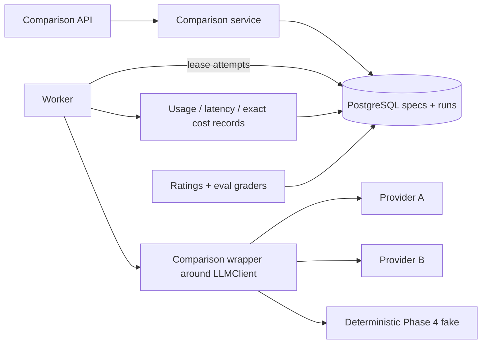

# Phase 10 handbook — Model comparison and repeatable evaluations

This phase builds an evidence-producing comparison backend, not a “best model” button. It sends equivalent, versioned cases through provider adapters; records exact observable inputs, translations, outputs, usage, latency, cost status, and errors; repeats nondeterministic work; and supports blinded human ratings and versioned evaluation suites.

## 1. Outcome, prerequisites, and non-goals

By the end, a user can discover enabled model configurations, launch a budgeted comparison, observe partial progress, inspect blinded results, rate outputs with a versioned rubric, define an immutable evaluation suite, and run that suite. One provider may fail without erasing other results. Every attempt points to an immutable canonical execution specification and hash.

Prerequisites:

- Phase 4 canonical `app/core/llm/LLMClient`, `LLMRequest`/`LLMResult`, and fake provider.
- Phase 5 durable work contract and worker leases.
- Phase 8 retrieval provenance if memory/context is part of a case.
- PostgreSQL, SQLAlchemy 2 sync sessions, Alembic, Pydantic 2, pytest.
- A per-user/global spend ledger or enforceable quota policy.

Non-goals:

- No universal leaderboard based on one prompt.
- No byte-for-byte reproducibility claim for stochastic hosted models.
- No provider API keys, arbitrary base URLs, or import paths in client requests.
- No live paid API in the default test suite.
- No automatic model replacement based solely on an LLM judge.

## 2. What “fair” and “reconstructable” mean

Fair does not mean providers receive identical JSON; their APIs and capabilities differ. It means the application begins from one neutral case, applies documented adapter translations, records every difference, uses comparable limits where possible, and marks unsupported capabilities rather than silently dropping them.

Reconstructable means you can explain what an old run meant after mutable configuration changes. Snapshot:

- canonicalization/spec schema version;
- exact system policy text or immutable version/content hash;
- ordered messages and multimodal asset hashes;
- retrieved memory/document IDs, versions, hashes, and retained snapshot required by policy;
- tool name/schema/version (tools remain disabled for the first comparison slice);
- requested provider/model and provider-reported model identifier;
- neutral sampling/output parameters;
- adapter name/version and translated provider request minus secrets;
- timeout, repetition index, pricing table snapshot/version, rubric/evaluator versions.

Privacy deletion may later redact text needed for reconstruction. Do the deletion and mark `reconstruction_status=redacted_by_policy`; never retain personal content merely to make an experiment convenient.

## 3. Architecture and state



Comparison state:

```text
queued -> running -> succeeded                 (all planned attempts succeeded)
                  -> completed_with_failures   (some succeeded, all terminal)
                  -> failed                    (none produced a usable result)
queued/running -> cancel_requested -> cancelled/completed_with_failures
```

Individual attempt state is `queued|running|succeeded|failed_retryable|failed_terminal|cancelled|outcome_unknown`. A comparison becomes terminal only after every expected `(candidate, repetition, case)` attempt is terminal or deliberately skipped.

The API creates specs/candidates/attempts in one transaction and returns `202`. A worker claims attempts. Network calls are outside DB transactions. Each attempt has its own idempotency key, lease, retry record, provider request ID, and sanitized failure.

## 4. Dependencies and folders

```text
app/
├── modules/comparisons/
│   ├── models.py                    # specs, candidates, attempts, results, ratings
│   ├── schemas.py                   # extra-forbid request/response contracts
│   ├── canonical.py                 # versioned canonical bytes + SHA-256
│   ├── repository.py                # owner SQL, attempt claims, aggregates
│   ├── service.py                   # budget/state/transaction decisions
│   ├── runner.py                    # adapter call and telemetry normalization
│   ├── pricing.py                   # immutable rate snapshots + Decimal arithmetic
│   ├── graders.py                   # deterministic graders + human-rating policy
│   ├── adapter.py                   # wraps LLMClient; no second provider port
│   ├── dependencies.py
│   └── router.py                    # comparison/result/rating HTTP contracts
├── modules/evals/
│   ├── models.py                    # immutable suites/cases/rubrics/runs
│   ├── repository.py
│   ├── service.py
│   ├── dependencies.py
│   └── router.py                    # suite/run HTTP contracts
├── core/llm/                        # existing Phase 4 LLMClient and provider adapters
└── workers/comparisons.py
tests/{unit,integration,contract,fakes}/...
```

The split is a business boundary, not ceremony. `comparisons` owns provider-neutral execution, candidate fairness, attempts/executions, telemetry, cost, results, and ratings. `evals` owns reusable suite/rubric versions, case publication, and eval-run aggregation; it asks the comparison service to schedule the same comparison work instead of creating a second provider runner. A comparison can exist without a suite, while an eval run reuses comparisons across many persisted cases.

Inside `comparisons`, `canonical.py` is pure and versioned: it accepts validated values and returns canonical bytes/hash, with no database, clock, secrets, or provider access. `pricing.py` is also pure: it calculates `Decimal` cost only from immutable usage and rate snapshots and never fetches today's price during reconstruction. `graders.py` contains deterministic, resource-bounded grading plus human-rating policy; it cannot import provider clients, execute user code, commit, or mutate suites. `runner.py` performs one translated call through the Phase 4 `LLMClient` and returns normalized telemetry but owns no transaction. `service.py` owns state rules, reservations, transaction boundaries, and guarded finalization; repositories only query/flush. `workers/comparisons.py` claims/fences durable work, commits the claim, dispatches outside a transaction, then opens a fresh transaction to finalize. HTTP dependencies wire these pieces; routers only validate/translate HTTP. These import and transaction boundaries keep eval orchestration from quietly becoming a second execution system.

Do not create a generic provider JSON dumping ground. Normalize common telemetry into typed columns and retain a sanitized, size-limited metadata JSON only for provider-specific fields.

## 5. Tables, constraints, and migration

### Configuration and immutable specs

`model_configs` contains safe server-managed metadata: provider key, allowlisted adapter key, requested exact model/snapshot, enabled capabilities, default neutral parameters, active flag, timestamps. Secrets live in deployment configuration, never this table or API.

`execution_specs` is append-only: `id`, `schema_version`, `canonicalization_version`, `canonical_json` JSONB, `canonical_bytes_hash`, `created_at`, and optional reconstruction status. Unique `(canonicalization_version, canonical_bytes_hash)` can deduplicate exact specs. Application roles get `SELECT/INSERT`, not `UPDATE`.

`comparison_runs` holds owner, title, blind flag, repetitions, expected attempt count, aggregate state, budget/spend reservation, durable lease/retry/cancel fields, timestamps, and base spec ID/hash.

`comparison_cases` persists every case, including a one-off inline case: `id`, `run_id`, non-null stable `case_key` (use `inline-1` for the create-comparison endpoint), ordered case index, immutable neutral input JSON/hash, and optional source eval-case ID. Unique `(run_id,case_key)`. Inline cases are inserted before attempts, so `comparison_attempts.case_id` is always a non-null FK and its uniqueness constraint is enforceable; never use nullable `case_id` as “inline.”

`comparison_candidates` holds run, source model-config ID, randomized blind label, **immutable config snapshot**, adapter version, translation notes, translated-spec ID/hash. Unique run/config and run/blind-label.

### Attempts, results, costs

`comparison_attempts` holds one **logical** run/candidate/non-null-case/repetition cell, durable work fields, unique idempotency key and unique `(run_id, candidate_id, case_id, repetition_index)`. It stores current claim/fence, attempt count, start/finish, and final logical outcome. A retry updates this aggregate state but never overwrites a dispatch record.

`comparison_attempt_executions` is the immutable audit child for each actual provider dispatch. Create its row in a short transaction after local translation/capability checks and immediately before the network call; commit, then call the provider with no database transaction open. Fields are:

- UUID `id`; non-null `attempt_id` FK; `execution_number` starting at 1; unique `(attempt_id,execution_number)`;
- non-null execution-spec ID/hash, adapter/version, requested model, provider idempotency key, worker/fencing token, `dispatched_at`;
- state `dispatching|succeeded|failed_retryable|failed_terminal|outcome_unknown|cancelled|lease_lost` and nullable `finalized_at`;
- nullable provider request ID/reported model/finish reason, wall and TTFT milliseconds, and typed input/cached/reasoning/output/tool/total usage columns;
- immutable price snapshot/hash/calculation version, `NUMERIC(20,8)` cost, ISO currency, and `provider_reported|locally_calculated|unknown` cost status;
- output hash for success, or bounded sanitized error code/message/HTTP category for failure—never raw provider bodies or credentials.

Only one guarded transition from `dispatching` to a terminal state is allowed, using the recorded fencing token. After finalization, deny application updates/deletes by service rule and preferably database permissions/trigger. If a worker dies after dispatch, recovery finalizes that row as `outcome_unknown` unless provider reconciliation proves the outcome; it never reuses or overwrites the row. A subsequent allowed retry inserts `execution_number + 1`. Concurrent workers allocate the next number while locking the parent attempt. If the provider supports idempotency/retrieval, record and reuse the logical downstream key deliberately; never assume that a new key makes an unknown charge safe.

`comparison_results` is the one-to-one public result projection for the selected successful execution. It has unique non-null `attempt_id` and unique non-null `winning_execution_id`. Put `UNIQUE(attempt_id,id)` on `comparison_attempt_executions`, then define `FOREIGN KEY (attempt_id,winning_execution_id) REFERENCES comparison_attempt_executions(attempt_id,id)`; also keep the ordinary parent-attempt FK. This exact same-attempt constraint prevents attaching another attempt's execution. Failed-dispatch telemetry stays in `comparison_attempt_executions`, not a mutable pseudo-result:

- output text/structured output and finish reason;
- wall latency and optional time-to-first-token in integer milliseconds;
- input, cached-input, output, reasoning, tool, and total token/unit counts as nullable integers—`null` means unavailable, not zero;
- provider request ID, requested model, provider-reported model;
- cost amount as `NUMERIC(20,8)`, ISO currency, `provider_reported|locally_calculated|unknown` status;
- immutable price snapshot JSON/hash and calculation version;
- the winning execution/output hash so its provenance is reconstructable.

Never use binary float for currency. Provider usage can include non-token units, and a provider’s published rates can change. Preserve the rate snapshot used; distinguish calculated estimate from billed cost.

### Ratings and evals

`rubric_versions`: immutable name/version, criteria/weights JSON, score range, instructions hash/text, evaluator constraints.

`result_ratings`: result, rubric version, rater type (`human|rule|model`), user/evaluator identity metadata, blinded-at-rating boolean, per-criterion scores, overall exact numeric score, rationale, evaluator spec/model/version, timestamp. Unique policy prevents accidental double voting while allowing a new rubric version.

`eval_suites`: owner, stable name, version, description, rubric version, immutable flag, content hash; unique owner/name/version. `eval_cases`: suite, stable case key, input spec, expected-output/grader configuration, tags; unique suite/key. Never edit a published suite—create a new version.

The `NeutralCaseDTO` schema is exact and provider-independent: `{system?,messages,max_output_tokens,temperature?,response_format?}`. `messages` and `max_output_tokens` are required/non-null. `system` is omitted or a non-null string up to 20,000 characters; messages contain 1–100 exact objects `{role:"user"|"assistant",content:string 1..20_000}` with a 100,000-character total; `max_output_tokens` is integer 1–8,192; temperature is omitted or a non-null decimal 0–2. Response format is omitted or exactly `{type:"text"}` / `{type:"json_schema",name,schema}`. JSON-schema `name` is 1–64 characters matching `^[A-Za-z][A-Za-z0-9_-]{0,63}$`; `schema` is a non-null object using the server's documented Draft 2020-12 keyword allowlist. Its canonical UTF-8 encoding is at most 32,768 bytes; nesting depth is at most 10 with the root at depth 1; all `properties` maps together declare at most 200 property names; any array value in the schema contains at most 100 elements; and any string value is at most 4,000 characters. Reject all `$ref`/remote references in v1, arrays/objects beyond those bounds, unknown fields at every nesting level, and explicit null optionals. Tools, files, arbitrary provider parameters/base URLs, and nullable entries are excluded from the baseline.

These are application resource bounds, not proof a provider supports the schema. Validate them before canonicalization, then run the capability matrix across every selected adapter. A provider that lacks equivalent JSON-schema output returns `400 COMPARISON_CAPABILITY_MISMATCH`; never downgrade to plain text. Test 32,767/32,768/32,769 UTF-8 bytes (not characters), depth 9/10/11, 199/200/201 properties, arrays 99/100/101, multibyte strings, `$ref`, null, and unknown fields.

An eval case is exactly `{key,input,expected?,grader,tags?}`. Key is 1–100 characters matching `^[A-Za-z0-9][A-Za-z0-9._-]*$`; input is the exact neutral case; tags are omitted or a non-null unique array of 0–20 strings, each stripped 1–50. For exact match, `expected` is required, non-null string 1–20,000 and grader is exactly `{"type":"exact_match","normalization":"none"|"trim"|"casefold"}`. For JSON Schema, expected must be omitted or null and grader is exactly `{"type":"json_schema","schema":object}`. For human rating, expected must be omitted or null and grader is exactly `{"type":"human","rubric_version_id":UUID}`. Grader schemas use the same exact JSON-schema bounds above. Reject Python/import/regex/code/URL/model-judge definitions and every unknown/null-required field. The suite service checks discriminator/expected compatibility and canonicalizes the complete case. The canonical UTF-8 bytes of the entire create-suite body—including metadata, all cases, expected values, graders, and tags—must be at most 2,000,000 bytes; check this before database inserts and return `413 EVAL_SUITE_TOO_LARGE` above the cap.

`eval_runs`: owner, suite snapshot/hash, selected candidates, comparison-run link(s), durable-work fields, aggregate metrics JSON/version, timestamps.

Migration tests must verify all uniqueness/checks/FKs, exact numeric round trips, terminal-execution immutability, the result-to-same-attempt execution constraint, and blank-database upgrade. Prove two concurrent retry claimers cannot allocate the same execution number. Index logical work claims on `(status,next_attempt_at,lease_expires_at)`, executions on `(attempt_id,execution_number)`, and histories on `(user_id,created_at DESC,id DESC)`.

## 6. Canonical execution specification

Canonicalize before the insert and persist both JSON and digest. This v1 function is a deliberately constrained application format, not a claim of RFC 8785 compliance: normalize Unicode upstream, represent decimals/timestamps as specified strings, forbid NaN/infinity and unordered sets, use UTF-8, sorted object keys, and fixed compact separators. Version these rules forever.

```python
import hashlib
import json
from typing import Any


def canonical_spec_bytes(spec: dict[str, Any]) -> bytes:
    return json.dumps(
        spec,
        ensure_ascii=False,
        sort_keys=True,
        separators=(",", ":"),
        allow_nan=False,
    ).encode("utf-8")


def canonical_spec_hash(spec: dict[str, Any]) -> str:
    return hashlib.sha256(canonical_spec_bytes(spec)).hexdigest()
```

If multiple languages must independently reproduce hashes, adopt and test an RFC 8785 implementation instead of assuming `json.dumps` is cross-language canonical. Store `canonicalization_version="workspace-json-v1"` now so a correction does not reinterpret history.

## 7. Adapter contract and telemetry

The comparison adapter **wraps**, rather than replaces, Phase 4's canonical `LLMClient`. `translate()` converts the neutral case into the existing `LLMRequest`; `generate()` delegates to `LLMClient.generate()`. The wrapper adds adapter-version/translation notes and maps the existing `LLMResult` plus provider-specific safe telemetry into comparison records. If Phase 4 lacks a needed usage field, extend the canonical result backward-compatibly and update every provider/fake contract—do not invent a second client protocol. It must not commit or know HTTP responses.

```python
from dataclasses import dataclass
from decimal import Decimal
from typing import Protocol

from app.core.llm.client import LLMClient
from app.core.llm.types import LLMRequest, LLMResult


@dataclass(frozen=True)
class ModelUsage:
    input_units: int | None
    output_units: int | None
    cached_input_units: int | None = None
    reasoning_units: int | None = None


@dataclass(frozen=True)
class ModelOutcome:
    text: str
    provider_request_id: str | None
    provider_reported_model: str | None
    finish_reason: str | None
    usage: ModelUsage
    provider_reported_cost: Decimal | None
    currency: str | None


class ComparisonRunner:
    def __init__(self, client: LLMClient, *, model: str, adapter_version: str) -> None:
        self._client = client
        self.model = model
        self.adapter_version = adapter_version

    def translate(self, neutral_spec: dict[str, object]) -> tuple[LLMRequest, list[str]]:
        """Validate/translate into the canonical Phase 4 request; record every difference."""
        raise NotImplementedError

    def generate(self, request: LLMRequest) -> LLMResult:
        return self._client.generate(request)
```

`ModelOutcome` above is the comparison persistence projection, produced from `LLMResult` plus measured timing and a versioned price lookup; it is not a provider-call interface. Extend the Phase 4 result for provider request/model/cost metadata only through a reviewed shared-contract migration.

Phase 4's initial `LLMRequest` has no structured-response-format field. Until you extend that shared contract and all adapters/fakes, a `json_schema` comparison must fail `COMPARISON_CAPABILITY_MISMATCH`; the wrapper must never silently translate it to ordinary text. The same rule applies to any neutral field that cannot be represented faithfully.

Measure wall latency with `time.monotonic_ns()`, not wall-clock subtraction. Time-to-first-token exists only when an adapter truly streams and defines the first meaningful output event. Store null otherwise. Keep request timeout, queue wait, and provider latency separate.

Never log prompts, outputs, authorization headers, or raw provider errors by default. Request/result IDs may go in structured logs and traces; do not use them as high-cardinality metric labels.

## 8. Complete endpoint worksheets

Request schemas set Pydantic `extra="forbid"`; unknown fields receive the shared `422 REQUEST_VALIDATION_FAILED`. Unless explicitly marked nullable, fields cannot be null. All resource IDs are UUID path parameters. Other-user IDs are indistinguishable from absent IDs. Unless listed, there are no query parameters/request body on GET and no special response header beyond content type/request ID.

Bare `401` and `422` below mean `401 INVALID_ACCESS_TOKEN` and `422 REQUEST_VALIDATION_FAILED`, using the foundation's exact error envelope/request ID. A named owner-scoped `404` is returned identically for absent and foreign resources.

Every required `Idempotency-Key` follows Phase 8's exact policy: one ASCII value matching `^[A-Za-z0-9][A-Za-z0-9._:-]{0,127}$`, length 1–128. Missing is `400 IDEMPOTENCY_KEY_REQUIRED`; malformed/multiple is `422 REQUEST_VALIDATION_FAILED`; same key/different canonical input is `409 JOB_IDEMPOTENCY_CONFLICT`.

The public DTOs below are normative. Objects expose no undocumented fields; timestamps are UTC-normalized offset-aware RFC 3339 strings; UUIDs are canonical strings. A `money-string` matches `^(0|[1-9][0-9]{0,5})(\.[0-9]{1,8})?$`, is serialized without exponent, and represents 0–100 inclusive unless a narrower server/user cap applies. A `score-string` matches `^-?(0|[1-9][0-9]{0,2})(\.[0-9]{1,4})?$`, is non-exponential, and is constrained by the referenced rubric (always within -100..100). Nullable keys are always present as a value or JSON `null`.

- Closed capability names are `text|system_message|temperature|json_schema|streaming|usage`; closed neutral parameter names are `system|messages|max_output_tokens|temperature|response_format`. Closed capability-issue names used in error details are `context_length|max_output_tokens|system_message|temperature|response_format_json_schema|role_sequence|streaming_usage`.
- `ModelConfigDTO` has exactly `id: UUID`, `display_name: string` (1–100), `provider: string` (1–50, `^[a-z][a-z0-9_-]*$`), `requested_model: string` (1–200), `adapter_version: string` (1–64), `capabilities: unique array[capability]` (1–6), and `allowed_parameters: unique array[neutral-parameter]` (1–5). Secrets, URLs, current prices, and disabled state are absent.
- `ModelConfigListDTO` has exactly `items: array[ModelConfigDTO]` (0–requested limit) and `next_cursor: string|null` (opaque base64url 1–2,048 when non-null).
- `ComparisonAttemptCountsDTO` has exactly seven nonnegative integer keys—`queued`, `running`, `succeeded`, `failed_retryable`, `failed_terminal`, `cancelled`, `outcome_unknown`—whose sum equals `expected_attempts`.
- `ModelSafeErrorDTO` has exactly `code: string` (1–64, `^[A-Z][A-Z0-9_]*$`), `message: string` (1–500), `http_status: integer|null` (400–599 when non-null), `retryable: boolean`, and `outcome_unknown: boolean`; it never contains provider bodies/credentials.
- `CandidateDTO` has exactly `id: UUID`, `blind_label: string` (1–3 uppercase ASCII letters), `identity_revealed: boolean`, `model_config_id: UUID|null`, `provider: string|null` (1–50), `requested_model: string|null` (1–200), `config_snapshot_hash: 64-lowercase-hex string`, and `translation_notes: array[string]` (0–20, each 1–500). The three identity fields are all null until reveal is permitted and all non-null afterwards.
- `ComparisonRunSummaryDTO` has exactly: `id: UUID`; `title: string|null` (stripped 1–200); `status: "queued"|"running"|"succeeded"|"completed_with_failures"|"failed"|"cancel_requested"|"cancelled"`; `blind: boolean`; `repetitions: integer` (1–10); `expected_attempts: integer` (1–40,000); `attempt_counts: ComparisonAttemptCountsDTO`; `reserved_cost: money-string`; `consumed_cost: money-string`; `currency: "USD"`; `cost_status: "complete"|"partial_unknown"|"unknown"`; `created_at: timestamp`; `started_at: timestamp|null`; and `finished_at: timestamp|null`.
- `ExecutionSpecDTO` has exactly `id: UUID`, `schema_version: string` (1–32), `canonicalization_version: string` (1–64), `canonical_bytes_hash: 64-lowercase-hex string`, and `spec: object` obeying the neutral-schema limits and at most 500,000 canonical UTF-8 bytes.
- `ComparisonRunDTO` has every `ComparisonRunSummaryDTO` field plus `base_spec_hash: 64-lowercase-hex string`, `candidates: array[CandidateDTO]` (2–8), `execution_specs: array[ExecutionSpecDTO]|null` (null when not requested, otherwise 1–9), and `error: ModelSafeErrorDTO|null`. Error is non-null only for aggregate `failed`; terminal statuses require `finished_at`, and nonterminal statuses require it to be null.
- `ComparisonRunListDTO` has exactly `items: array[ComparisonRunSummaryDTO]` (0–requested limit) and `next_cursor: string|null` (opaque base64url 1–2,048 when non-null).
- `ModelUsageDTO` has exactly `input_units`, `cached_input_units`, `output_units`, `reasoning_units`, `tool_units`, and `total_units`; each is an integer|null, 0–1,000,000,000 when known. Null means unavailable and must not be changed to zero.
- `ComparisonResultDTO` has exactly: `result_id: UUID|null`; `attempt_id: UUID`; `candidate_id: UUID`; `blind_label: string` (1–3 uppercase); `model_config_id: UUID|null`; `requested_model: string|null` (1–200); `provider_reported_model: string|null` (1–200); `case_key: string` (1–100); `repetition_index: integer` (1–10); `status: "queued"|"running"|"succeeded"|"failed_retryable"|"failed_terminal"|"cancelled"|"outcome_unknown"`; `output: string|object|null` (string 1–200,000 characters or object <=200,000 canonical UTF-8 bytes); `finish_reason: string|null` (1–100); `latency_ms: integer|null` (0–3,600,000); `time_to_first_token_ms: integer|null` (0–3,600,000); `usage: ModelUsageDTO`; `cost: money-string|null`; `currency: "USD"|null`; `cost_status: "provider_reported"|"locally_calculated"|"unknown"`; `provider_request_id: string|null` (1–200); and `error: ModelSafeErrorDTO|null`. Queued/running/cancelled items have null result/output/error and unmeasured telemetry; succeeded requires non-null result/output and null error; failed/unknown has null result/output and non-null error. Unknown cost requires null cost/currency; reported/calculated cost requires non-null cost and `USD`. Identity fields follow reveal policy.
- `ComparisonResultListDTO` has exactly `items: array[ComparisonResultDTO]` (0–requested limit) and `next_cursor: string|null` (1–2,048 opaque base64url when non-null).

A published `RubricVersion` has 1–20 criteria. Each criterion key is 1–64 characters matching `^[A-Za-z][A-Za-z0-9_-]{0,63}$`; its global score bounds are decimal values from -100 through 100 with minimum < maximum; weights are positive decimals and sum exactly 1 under the rubric's versioned decimal rules. `RatingDTO` has exactly `id: UUID`, `result_id: UUID`, `rubric_version_id: UUID`, `rater_type: "human"`, `criterion_scores: object`, `overall_score: score-string`, `rationale: string|null` (stripped 1–2,000), `blinded_at_rating: boolean`, and `created_at: timestamp`. `criterion_scores` contains every rubric criterion key exactly once, no extras, and each score-string falls inside that criterion's bounds; overall score lies inside the rubric's declared overall range and equals the versioned weighted calculation at four decimal places.

- `EvalCaseDTO` has exactly `id: UUID`, `key: string` (1–100, `^[A-Za-z0-9][A-Za-z0-9._-]*$`), `case_index: integer` (1–500), `input: NeutralCaseDTO`, `expected: string|null`, `grader`, and `tags: unique array[string]` (0–20, each 1–50). For `exact_match`, expected is a 1–20,000 string; for `json_schema`, expected is null and the grader schema uses the 32,768-byte/depth/property/array limits; for `human`, expected is null. Grader is exactly one of `{"type":"exact_match","normalization":"none"|"trim"|"casefold"}`, `{"type":"json_schema","schema":object}`, or `{"type":"human","rubric_version_id":UUID}`.
- `EvalSuiteSummaryDTO` has exactly `id: UUID`, `name: string` (1–100), `version: string` (1–50), `description: string|null` (1–2,000), `rubric_version_id: UUID`, `based_on_suite_id: UUID|null`, `suite_hash: 64-lowercase-hex string`, `case_count: integer` (1–500), and `created_at: timestamp`.
- `EvalSuiteDTO` has every summary field plus `cases: array[EvalCaseDTO]|null` and `next_cursor: string|null`. With `include_cases=false`, both are null; with true, cases contains 0–requested limit in `case_index,id` order and the cursor is null or 1–2,048 characters.
- `CandidateMetricDTO` has exactly `candidate_id: UUID`, `blind_label: string` (1–3 uppercase ASCII), `attempt_count: integer >=0`, `succeeded_count: integer >=0`, `failed_count: integer >=0`, `score_count: integer >=0`, `mean_score: score-string|null`, `median_score: score-string|null`, `score_ci_low: score-string|null`, `score_ci_high: score-string|null`, `confidence_level: "0.95"|null`, `confidence_method: "bootstrap_percentile_v1"|null`, `latency_p50_ms: integer|null` and `latency_p95_ms: integer|null` (0–3,600,000), `known_cost: money-string`, `unknown_cost_execution_count: integer >=0`, and `failure_rate: money-string` constrained to 0–1. Counts cannot exceed expected cells and scores obey the rubric range. All four confidence fields are null when fewer than two scores exist; otherwise both bounds/method/level are non-null and `low <= mean <= high` under the named deterministic seeded algorithm.
- `CaseMetricDTO` has exactly `case_key: string` (1–100), `candidate_id: UUID`, `blind_label: string` (1–3 uppercase ASCII), `attempt_count: integer >=0`, `succeeded_count: integer >=0`, `failed_count: integer >=0`, `mean_score: score-string|null`, and `failure_rate: money-string` constrained to 0–1.
- `EvalRunDTO` has exactly: `id: UUID`; `suite_id: UUID`; `suite_hash: 64-lowercase-hex string`; `suite_version: string` (1–50); `rubric_version_id: UUID`; `status: "queued"|"running"|"succeeded"|"completed_with_failures"|"failed"|"cancel_requested"|"cancelled"`; `blind: boolean`; `repetitions: integer` (1–10); `model_config_count: integer` (1–8); `case_count: integer` (1–500); `expected_attempts: integer` (1–40,000); `attempt_counts: ComparisonAttemptCountsDTO`; `candidates: array[CandidateDTO]` (1–8); `reserved_cost: money-string`; `consumed_cost: money-string`; `currency: "USD"`; `cost_status: "complete"|"partial_unknown"|"unknown"`; `metrics_version: string` (1–64); `candidate_metrics: array[CandidateMetricDTO]` (0–8); `case_metrics: array[CaseMetricDTO]|null` (null when excluded, otherwise 0–requested case limit); `next_case_cursor: string|null` (1–2,048 when non-null); `error: ModelSafeErrorDTO|null`; `created_at: timestamp`; `started_at: timestamp|null`; and `finished_at: timestamp|null`. Error is non-null only for aggregate failed; terminal states require finished time. A non-null case cursor requires non-null case metrics and another page.

Capability errors use the shared error envelope with `details` exactly `{incompatibilities,total_count,truncated}`. `incompatibilities` is an array of 1–100 objects `{model_config_id:UUID,case_key:string|null,issues:unique array[capability-issue] 1..7}`; `case_key` is null for run-wide mismatch and 1–100 otherwise. `total_count` is 1–4,000 and may exceed the returned array only when `truncated=true`. Compact details are capped at 32,768 UTF-8 bytes. This applies to `COMPARISON_CAPABILITY_MISMATCH` and `EVAL_CAPABILITY_MISMATCH`; no provider payload/prompt is included.

### Endpoint 1 — list model configurations

- **Purpose/method/path/auth:** Discover safe enabled targets; `GET /api/v1/model-configs`; authenticated.
- **Path/query:** No path params. `capability` is optional non-null and one closed capability name; `provider` is optional non-null stripped 1–50 characters matching `^[a-z][a-z0-9_-]*$`; `limit` is integer default 20, range 1–100; `cursor` is optional non-null opaque base64url 1–2,048 characters bound to both filters and stable `(display_name ASC,id ASC)` ordering. Unknown/repeated scalar parameters are rejected.
- **Body:** None; any nonempty request body is rejected as `400 REQUEST_BODY_NOT_ALLOWED`, never ignored or interpreted.
- **Success:** `200 ModelConfigListDTO`; empty is `{"items":[],"next_cursor":null}`. No secret, price promise, disabled row, or base URL. No special headers.
- **Errors:** `401 INVALID_ACCESS_TOKEN`, `400 INVALID_CURSOR`, `422 REQUEST_VALIDATION_FAILED`.
- **Tables/transaction/side effects:** Read active `model_configs`; read-only; none.
- **Tests:** Every capability; provider 0/1/50/51/bad/null/repeated; limit 0/1/20/100/101; cursor 0/1/2,048/2,049/tamper/filter mismatch; stable ties/empty; disabled hidden; exact DTO; no secrets.

### Endpoint 2 — create model comparison

- **Purpose/method/path/auth:** Queue equivalent repetitions; `POST /api/v1/model-comparisons`; authenticated; exactly one 1–128-character common-policy `Idempotency-Key` required.
- **Path/query:** None.
- **Body:** Exactly `{title?,case,model_config_ids,repetitions,blind?,budget}`. `title` may be omitted/null and is stripped 1–200 when non-null. `case` is the exact neutral object above: `messages` and `max_output_tokens` are required; `system`, `temperature`, and `response_format` alone may be omitted, never explicit null. `model_config_ids` has 2–8 unique non-null UUIDs; `repetitions` is required integer 1–10; `blind` is boolean default true. `budget` is required and exactly `{max_cost,currency,max_wall_seconds}`: max cost is a non-exponential `money-string`, value strictly greater than 0 and <=`100.00000000` plus current user/server cap; currency is the literal `"USD"`; wall seconds is integer 10–900. Unknown/null required fields are rejected at every level.
- **Success:** `202 ComparisonRunDTO` with `execution_specs:null`; `Location: /api/v1/model-comparisons/{id}` and integer `Retry-After: 2`. A replay returns the stored DTO/status/headers.
- **Errors:** `400 COMPARISON_CAPABILITY_MISMATCH` with the exact capped capability details DTO; `400 COMPARISON_BUDGET_INVALID`; `404 MODEL_CONFIG_NOT_FOUND`; `409 JOB_IDEMPOTENCY_CONFLICT`; `409 SPEND_LIMIT_EXCEEDED`; `422 REQUEST_VALIDATION_FAILED`; `401 INVALID_ACCESS_TOKEN`.
- **Tables/transaction:** Lock spend ledger; snapshot config/specs; insert run, non-null `comparison_cases` row `inline-1`, candidates, attempts and reserve spend atomically; service commits once.
- **Side effects:** Worker calls providers later; API does not.
- **Tests:** Every nested bound/unknown/null/default; max-cost syntax/value 0/epsilon/100/over and non-USD; capability detail 1/100/101-truncated and 32,768-byte cap; idempotency key 0/1/128/129/bad/multiple; canonical hash; immutable snapshots; unique blind labels; replay/conflict; spend race; exact DTO; no provider call.

### Endpoint 3 — list comparisons

- **Purpose/method/path/auth:** Owner history; `GET /api/v1/model-comparisons`; authenticated.
- **Path/query:** Optional non-null `status` is one of `queued|running|succeeded|completed_with_failures|failed|cancel_requested|cancelled`; optional non-null `created_after` is an aware RFC 3339 exclusive lower bound; `limit` is integer default 20, range 1–100; optional non-null `cursor` is opaque base64url 1–2,048 characters bound to filters and `(created_at DESC,id DESC)`. No body/other/repeated scalar parameters.
- **Success:** `200 ComparisonRunListDTO`, stable `created_at DESC,id DESC`; no candidates/specs/outputs. No special headers.
- **Errors:** `400 INVALID_CURSOR`, `422`, `401`.
- **Tables/transaction/side effects:** Read owner runs/aggregates; read-only; none.
- **Tests:** Every/unknown/null status; aware/naive/null time and boundary; limit 0/1/20/100/101; cursor length/tamper/filter mismatch; ties, empty DTO, owner isolation, exact partial counts/cost states.

### Endpoint 4 — get comparison

- **Purpose/method/path/auth:** Poll run and reconstructability metadata; `GET /api/v1/model-comparisons/{comparison_id}`; owner.
- **Path/query:** UUID `comparison_id`; `include_specs` is boolean default false and rejects null/repeated/unknown values; no body.
- **Success:** `200 ComparisonRunDTO`; `execution_specs` is null when false and the bounded immutable DTO array when true. Integer `Retry-After: 2` appears only for `queued|running|cancel_requested`; it is omitted for terminal states. Specs never contain secrets/provider headers.
- **Errors:** `404 MODEL_COMPARISON_NOT_FOUND`, `422`, `401`.
- **Tables/transaction/side effects:** Read run/candidates/spec metadata; none.
- **Tests:** `include_specs` omitted/true/false/null/invalid/repeated, every state, exact DTO and retry header, spec bounds/redaction, no mutable config substitution, other-user `404`.

### Endpoint 5 — list comparison results

- **Purpose/method/path/auth:** Inspect comparable attempts; `GET /api/v1/model-comparisons/{comparison_id}/results`; owner.
- **Path/query:** UUID `comparison_id`; optional non-null `candidate_id` is a candidate UUID belonging to this run; optional non-null `status` is `queued|running|succeeded|failed_retryable|failed_terminal|cancelled|outcome_unknown`; `limit` is integer default 20, range 1–100; optional non-null cursor is opaque base64url 1–2,048 characters bound to filters/reveal and stable `(case_key ASC,repetition_index ASC,blind_label ASC,attempt_id ASC)` order; `reveal_identity` is boolean default false. Unknown/repeated scalar parameters are rejected. Identity true is allowed only after configured completion/rating policy.
- **Body:** None.
- **Success:** `200 ComparisonResultListDTO`; every queued/failed/succeeded item has the exact null/state/identity invariants above. No special headers.
- **Errors:** `404 MODEL_COMPARISON_NOT_FOUND`; `404 COMPARISON_CANDIDATE_NOT_FOUND` for a candidate not in the owner-visible run; `403 COMPARISON_IDENTITY_NOT_REVEALABLE`; `400 INVALID_CURSOR`; `422`; `401`.
- **Tables/transaction/side effects:** Owner-check run; read attempts/results/candidate snapshot; read-only; none.
- **Tests:** Candidate absent/foreign/malformed; every/unknown/null status; limits 0/1/20/100/101; cursor length/tamper/filter/reveal mismatch; reveal boolean/policy; blinding; null-vs-zero usage; cost/output bounds; failed+succeeded DTOs; stable ties; no raw errors.

### Endpoint 6 — rate a result

- **Purpose/method/path/auth:** Record one human rating under an exact rubric; `POST /api/v1/model-comparison-results/{result_id}/ratings`; authenticated owner/rater.
- **Path/query:** UUID `result_id`; no query parameters.
- **Body:** Exactly `{rubric_version_id,criterion_scores,overall_score,rationale?}`. Rubric ID is a non-null UUID. `criterion_scores` is a non-null object with 1–20 properties and must contain each criterion key from that immutable rubric exactly once; values are non-null `score-string`s within each criterion's inclusive min/max. `overall_score` is a non-null `score-string`, must equal the rubric's weighted four-decimal calculation and fall in its overall range. Rationale may be omitted/null or stripped 1–2,000; whitespace/2,001/unknown fields fail `422`.
- **Success:** `201 RatingDTO`; no `Location` until a retrieve-rating endpoint exists; `blinded_at_rating` records actual state.
- **Errors:** `404 COMPARISON_RESULT_NOT_FOUND`, `404 RUBRIC_VERSION_NOT_FOUND`, `409 RATING_ALREADY_EXISTS`, `409 RESULT_NOT_RATEABLE`, `422`, `401`.
- **Tables/transaction:** Lock/read result+rubric, validate criterion set/weighted score, insert immutable rating, commit once.
- **Side effects:** May satisfy identity-reveal threshold only after commit; never reruns model.
- **Tests:** 0/1/20/21 criteria; missing/extra/bad-key/null/non-decimal/below/at/above bounds; weighted mismatch/rounding; rationale omitted/null/1/2,000/2,001/whitespace; exact DTO/blind flag; duplicate race; rubric immutability; no identity leak.

### Endpoint 7 — create immutable eval-suite version

- **Purpose/method/path/auth:** Publish repeatable cases; `POST /api/v1/eval-suites`; authenticated.
- **Path/query:** None.
- **Body:** Exactly `{name,version,description?,rubric_version_id,based_on_suite_id?,cases}`. Name is stripped non-null 1–100; version is stripped non-null 1–50; description may be omitted/null or stripped 1–2,000; rubric ID is UUID; base suite ID may be omitted/null UUID; cases is a non-null array of 1–500 exact eval-case objects with unique keys. Canonical UTF-8 bytes for the complete request are limited to 2,000,000, measured after validation/default materialization and before inserts. Unknown fields are forbidden at every nesting level.
- **Success:** `201 EvalSuiteSummaryDTO`; `Location: /api/v1/eval-suites/{id}`.
- **Errors:** `404 RUBRIC_VERSION_NOT_FOUND`, `404 BASE_SUITE_NOT_FOUND`, `409 EVAL_SUITE_VERSION_EXISTS`, `400 EVAL_GRADER_UNSAFE`, `400 EVAL_GRADER_EXPECTATION_MISMATCH`, `413 EVAL_SUITE_TOO_LARGE`, `422`, `401`.
- **Tables/transaction:** Insert immutable suite/cases and canonical hashes atomically; service commits.
- **Side effects:** None; no model calls.
- **Tests:** Hash determinism, duplicate case/version, rollback on bad case, forbidden arbitrary grader code/import, exact 1,999,999/2,000,000/2,000,001 UTF-8 byte boundary, per-schema byte/depth/property/array boundaries, and ownership/access policy.

### Endpoint 8 — get eval suite

- **Purpose/method/path/auth:** Inspect immutable suite before spending; `GET /api/v1/eval-suites/{suite_id}`; owner or explicitly shared reader.
- **Path/query:** UUID `suite_id`; `include_cases` is boolean default `true`; `limit` is integer default 50, range 1–100; `cursor` is optional non-null opaque base64url text 1–2,048 characters bound to suite ID/hash and stable `(case_index ASC,id ASC)` order. When `include_cases=false`, clients must omit `cursor` and `limit`; explicitly supplying either returns `422 REQUEST_VALIDATION_FAILED`. No body or other query fields.
- **Success:** `200 EvalSuiteDTO`; with `include_cases=false`, `cases:null` and `next_cursor:null`; otherwise return 0–limit ordered cases and cursor. `ETag` is the quoted suite hash.
- **Errors:** `404 EVAL_SUITE_NOT_FOUND`, `400 INVALID_CURSOR`, `422`, `401`.
- **Tables/transaction/side effects:** Read suite/cases/rubric; none.
- **Tests:** `include_cases` default/true/false/invalid/null; limits 0/1/50/100/101; cursor 0/1/2,048/2,049 characters, tamper/suite/hash mismatch; forbidden limit/cursor with false; ETag, immutable content, stable tie/order and no gaps/duplicates; access boundary; no hidden expected answers in a candidate-facing mode if applicable.

### Endpoint 9 — start eval run

- **Purpose/method/path/auth:** Execute a suite across selected configs/repetitions; `POST /api/v1/eval-runs`; authenticated; exactly one common-policy `Idempotency-Key` required.
- **Path/query:** None.
- **Body:** Exactly `{suite_id,model_config_ids,repetitions,blind?,budget}`. Suite ID is UUID; config IDs are 1–8 unique UUIDs; repetitions is required integer 1–10; blind is boolean default true. Budget is exactly `{max_cost,currency,max_wall_seconds}`: max cost is a non-exponential `money-string` strictly greater than 0 and <=`100.00000000` plus current cap, currency is literal `"USD"`, and wall seconds is integer 10–900. Required fields are non-null and all nested unknowns are forbidden.
- **Success:** `202 EvalRunDTO` with `case_metrics:null,next_case_cursor:null`; `Location: /api/v1/eval-runs/{id}` and integer `Retry-After: 2`. Replay returns stored DTO/status/headers.
- **Errors:** `404 EVAL_SUITE_NOT_FOUND`; `404 MODEL_CONFIG_NOT_FOUND`; `400 EVAL_CAPABILITY_MISMATCH` with exact capped capability details; `400 EVAL_BUDGET_INVALID`; `409 SPEND_LIMIT_EXCEEDED`; `409 JOB_IDEMPOTENCY_CONFLICT`; `422`; `401`.
- **Tables/transaction:** Snapshot suite/config/pricing, reserve budget, create eval run plus comparison attempts atomically.
- **Side effects:** Worker later invokes adapters/graders; API does not.
- **Tests:** All nested/budget/currency bounds; idempotency key bounds/multiple/replay/conflict; capability details count/byte truncation; immutable suite snapshot; exact expected multiplication/DTO; spend race; partial incompatibility policy.

### Endpoint 10 — get eval run

- **Purpose/method/path/auth:** Poll progress and versioned aggregate scores; `GET /api/v1/eval-runs/{eval_run_id}`; owner.
- **Path/query:** UUID `eval_run_id`; `include_case_metrics` is boolean default false. When true, `case_limit` is integer default 50, range 1–100, and `case_cursor` is optional non-null opaque base64url 1–2,048 characters bound to run/hash and `(case_key ASC,candidate blind_label ASC)`; when false, clients must omit both `case_limit` and `case_cursor` or receive `422`. No body/other/repeated scalar fields.
- **Success:** `200 EvalRunDTO`; false yields null case metrics/cursor, true yields 0–limit metrics and cursor. Candidate metrics always use the named `metrics_version`, include failures in denominators, and preserve unknown cost. Integer `Retry-After: 2` appears only for `queued|running|cancel_requested`.
- **Errors:** `404 EVAL_RUN_NOT_FOUND`, `422`, `401`.
- **Tables/transaction/side effects:** Read eval run, underlying attempts/results/ratings, versioned aggregate; none. Aggregation may be a durable worker step, never mutate raw results.
- **Tests:** Include boolean omitted/true/false/null/invalid; case limit 0/1/50/100/101 and forbidden when false; cursor length/tamper/run/hash mismatch and forbidden when false; queued/partial/terminal exact DTO; failures in denominator; no retry double-counting/cherry-picking; exact rubric/metrics versions; owner boundary; retry header.

## 9. Vertical-slice build order

1. Server-seeded fake `model_configs`; list endpoint.
2. Canonical spec migration/functions with golden hash tests.
3. Create/get/list comparison and generated attempts; no worker.
4. Fake adapter worker for one repetition: create an execution row before dispatch, finalize it once, create the winning result, and record complete telemetry.
5. Multiple candidates/repetitions, retries as new immutable execution rows, partial failures, spend accounting/cancel checks.
6. Results with blinding and human ratings against one seeded rubric.
7. Eval-suite create/get with deterministic exact-match/schema graders.
8. Eval-run orchestration/aggregates.
9. Register comparison-attempt and eval-aggregation handlers in Phase 8's closed `app.workers.main` registry. Its composition test enumerates all Phase 5–10 durable operation kinds, executes one bounded iteration with fakes, and fails startup if any enabled kind lacks a handler. Phase 11's single worker command therefore consumes every documented queue.
10. One real adapter manually enabled; then a second adapter. Never require either in CI.

## 10. Pricing, spend, and failure rules

Provider pricing is live configuration. At attempt creation or execution, snapshot the exact rate card identifier/effective time/rates/units/currency. Calculate with `Decimal`; quantize only for presentation, not internal summation. Keep provider-reported billed cost separate from locally calculated cost. If usage/rates are missing, cost is `unknown`, not zero.

Reserve worst-case cost under a locked user budget row before queueing. Release unused reservation after each terminal attempt/run. Enforce per-run, per-user daily, and global circuit-breaker limits. Limit parallelism per provider to avoid rate-limit storms.

Spend follows **dispatches**, while quality follows **logical attempts**. Sum known cost across every `comparison_attempt_executions` row, including retryable/terminal/unknown executions; show a separate unknown-cost execution count and never coerce it to zero. Count each logical attempt once in success/failure and quality denominators, using only its final selected `comparison_result`. Report retry count and retry overhead separately. Quality latency is the winning execution's latency; end-to-end logical latency and total dispatch latency may be additional named metrics but must not be silently mixed. Thus a timeout followed by success costs two dispatches but produces one quality sample. Aggregation queries must start from expected attempts and join at most one winning result, not join raw executions and accidentally duplicate scores.

Classify failures:

- retryable: connection timeout before known acceptance, `429` honoring `Retry-After`, selected `5xx` under capped attempts;
- terminal: invalid request/capability, authentication/configuration, context too large after validated translation;
- outcome unknown: provider may have accepted/charged but response was lost; reconcile by provider ID/idempotency support before retrying.

One failed candidate does not roll back successful candidates. Terminal aggregate rules must be deterministic and include failures in displayed denominators.

The worker flow is fenced and explicit: claim logical attempt and commit; validate/translate locally; lock the attempt, allocate the next execution number, persist the execution spec/rate snapshot/downstream key, and commit; dispatch outside a transaction; then guard-finalize that exact execution and update the logical attempt/result/reservation in one fresh transaction. Losing the lease cannot authorize a stale worker to alter the attempt or a later execution. If finalization loses the fence, persist/alert through the recovery path; never overwrite the current owner's state. Recovery marks an abandoned `dispatching` execution unknown, reconciles when supported, and only then applies the capped retry policy.

## 11. Ratings and evaluation quality

Randomize candidate order using a stored seed and assign neutral labels such as A/B per run. Hide identity during rating when possible. Store whether the rating was actually blinded; do not claim it if the user already selected recognizable configs/outputs.

A rubric is versioned data: criteria, definitions, scale anchors, weights, examples, and evaluator instructions. Human ratings need inter-rater agreement when stakes grow. Model judging is explicitly out of this phase's executable grader allowlist; a future design would need its own execution spec, model/version, rubric, ordering, and rationale because it can be biased toward verbosity, provider style, or itself.

Start with deterministic graders:

- exact/normalized match for narrow facts;
- JSON Schema/Pydantic validation;
- required/forbidden substring rules;
- reference-backed unit-test-style calculations.

Then add human scoring. Treat model judging as a future phase extension and compare it against human-labeled cases before trusting it. Report distributions, medians/percentiles, success/failure counts, and sample size—not one misleading average.

## 12. Testing strategy

### Unit

- Golden canonical bytes/hash; reject NaN/unversioned values.
- JSON-schema UTF-8 byte/depth/property/array/string limits and total eval-suite byte cap at exact boundaries.
- Neutral-to-provider translations and capability mismatch notes.
- `Decimal` pricing across cached/reasoning/other units.
- Terminal aggregate state with every combination of outcomes; a failed dispatch then success contributes two dispatch costs/retry count but one quality sample.
- Deterministic graders, rubric validation, blinded ordering with fixed seed.

### PostgreSQL integration

- Immutable specs/suites, uniqueness, exact numeric persistence.
- Two workers do not claim one attempt; expired lease recovery.
- Every actual dispatch creates a new execution row; `(attempt,execution_number)` races converge, finalized rows reject update/delete, and a stale fence cannot finalize or replace a later execution.
- Spend reservation races cannot exceed a limit.
- Candidate/result/rating ownership joins; duplicate rating race.
- Partial provider failure commits successful sibling attempts; retry aggregation sums all known execution costs and preserves unknown cost without duplicating result/score/denominator.

### Fake-provider

The fake supports deterministic text/usage, variable delay via injected clock, rate-limit, timeout, malformed usage, reported-model mismatch, unknown outcome, and streaming first-token events. Tests never sleep or use money. Assert secrets/raw provider payloads are absent from database/client/log capture.

### Contract

For every worksheet assert exact status, media type, body schema, headers, stable error code/request ID, unknown/null handling, auth/ownership, OpenAPI responses, and idempotency behavior.

## 13. Curl and debugging

```bash
curl -i -X POST http://127.0.0.1:8000/api/v1/model-comparisons \
  -H "Authorization: Bearer $ACCESS_TOKEN" \
  -H "Idempotency-Key: compare-001" \
  -H "Content-Type: application/json" \
  -d '{"case":{"messages":[{"role":"user","content":"Explain a database transaction in 80 words."}],"max_output_tokens":256},"model_config_ids":["CONFIG_UUID_A","CONFIG_UUID_B"],"repetitions":3,"blind":true,"budget":{"max_cost":"1.50","currency":"USD","max_wall_seconds":180}}'
```

Debug from persisted truth: run -> candidate snapshot -> execution spec/hash -> attempt/lease -> translated spec -> result/usage/rate snapshot -> rating/rubric. Compare the hash by re-running canonicalization. If it differs, print safe structural paths/types, not secret prompt text.

Common failures:

- **Old run shows new model:** response joined mutable config instead of candidate snapshot.
- **Costs differ by a cent:** float arithmetic, premature rounding, changed rate card, or cached/reasoning units omitted.
- **Run never terminal:** expected-attempt count disagrees with actual unique attempts or an unknown outcome has no reconciliation policy.
- **Unfair output limits:** inspect translation notes and provider finish reasons.
- **TTFT is zero:** non-streaming adapter incorrectly populated it.
- **Blind rating leaks identity:** provider/model fields or deterministic candidate ordering appear in results/logging UI.

## 14. Security, reliability, and privacy

- Provider/API credentials are deployment secrets and scoped per environment; never returned or stored in config rows.
- Allowlist adapters/models; clients cannot supply URLs, headers, import paths, or raw provider payloads.
- Prompt/output data may be sensitive. Define retention, redaction, export, deletion, and provider data-use rules.
- Model output remains untrusted text. Tools are off initially; if added, Phase 5 validation/approval applies.
- Bound prompts, outputs, repetitions, configs, cases, concurrency, time, attempts, and spend.
- Honor `Retry-After`; add jitter; do not synchronize retries across workers.
- Log request/run/attempt/provider request IDs and safe failure categories, not prompts/outputs/keys.
- Use low-cardinality metrics: provider/adapter/status (after controlling cardinality), latency histograms, queue age, retry and spend totals. Exact model names can create cardinality/version churn; decide deliberately.
- Never publish “best” without workload, suite version, sample size, failures, uncertainty, date, and cost basis.

## 15. Exercises and checkpoint

Exercises:

1. Write and hash one execution spec; reorder object keys and prove the v1 hash is stable; reorder messages and prove it changes.
2. Edit a `model_config` after queueing and prove the old candidate still renders its snapshot.
3. Demonstrate `0.1 + 0.2` with float, then calculate a token bill with `Decimal`.
4. Run five fake repetitions and calculate output/latency variance.
5. Make one provider fail, one rate-limit then recover, and one succeed. Verify terminal aggregate and denominators.
6. Rate randomized A/B outputs, reveal identities later, and inspect `blinded_at_rating`.
7. Version a rubric by changing one criterion; prove old ratings keep the old version.
8. Create an eval suite containing a JSON-schema case, exact-match case, and human-scored case. Re-run it after an adapter change and compare distributions.
9. Return missing usage from the fake and prove the API says `null`/unknown rather than zero/free.

Checkpoint:

- [ ] Specs/config/prices/rubrics/suites are immutable snapshots with hashes/versions.
- [ ] Every expected candidate/case/repetition has one durable attempt.
- [ ] Costs use exact arithmetic and disclose reported/calculated/unknown status.
- [ ] Latency, TTFT, usage, errors, and provider identity are represented honestly.
- [ ] Partial failure preserves successes and remains visible.
- [ ] Spend/concurrency/retry limits are enforced transactionally.
- [ ] Ratings record blinding and exact rubric/evaluator version.
- [ ] Automated tests use fakes; live paid tests are opt-in.

## 16. What you should be able to explain after this phase

Explain equivalent versus identical requests; snapshot versus mutable configuration; canonical bytes/hash and why canonicalization is versioned; stochastic repetition; exact money and price snapshots; provider-reported versus calculated cost; wall latency versus TTFT; partial failure and outcome unknown; blinding/randomization; deterministic graders versus human ratings; why model graders are deferred and cannot be treated as ground truth; versioned rubric/eval suite; and why “best model” is always conditional on workload and measurement.

## 17. Current official primary documentation

- [RFC 8785: JSON Canonicalization Scheme](https://www.rfc-editor.org/rfc/rfc8785)
- [Python `decimal`](https://docs.python.org/3/library/decimal.html) and [`time.monotonic_ns`](https://docs.python.org/3/library/time.html#time.monotonic_ns)
- [PostgreSQL exact numeric types](https://www.postgresql.org/docs/current/datatype-numeric.html)
- [PostgreSQL explicit locking](https://www.postgresql.org/docs/current/explicit-locking.html)
- [Pydantic strict mode](https://docs.pydantic.dev/latest/concepts/strict_mode/)
- [OpenTelemetry metrics concepts](https://opentelemetry.io/docs/concepts/signals/metrics/) — especially latency histograms and cardinality.
- [Official OpenAI API model reference](https://developers.openai.com/api/reference/resources/models) and [Evals API reference](https://developers.openai.com/api/reference/resources/evals) — representative adapter inputs; do not infer cross-provider semantics.
- [Anthropic Messages API reference](https://docs.anthropic.com/en/api/messages)
- [Google Gemini token documentation](https://ai.google.dev/gemini-api/docs/tokens) and [current pricing](https://ai.google.dev/gemini-api/docs/pricing)

Before enabling any adapter, consult that provider’s current official request/response, exact model/snapshot availability, usage fields, streaming events, idempotency, rate limits, errors, retention/data-use, and pricing pages. Record the documentation date and implement contract fixtures from sanitized responses; do not hard-code this handbook’s examples as live truth.
